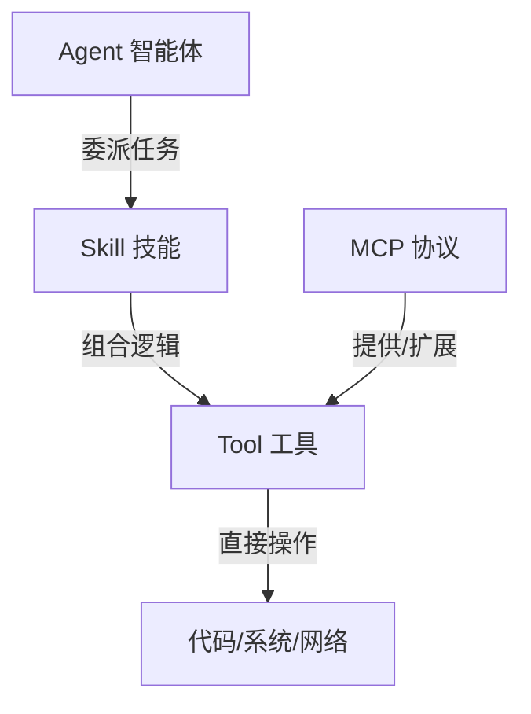

# Vibe Coding 核心概念指南

在 Gemini CLI 的开发生态中，Agent、MCP、Skill 和 Tool 构成了从原子操作到高级自动化的四个层级。理解它们的区别与协作方式，是高效进行 Vibe Coding 的基础。

## 1. 概念定义

### 工具 (Tool)
*   **定义**：AI 助手可以直接调用的最小功能单元（原子函数）。
*   **示例**：`read_file` (读取文件), `run_shell_command` (执行命令), `replace` (替换代码)。
*   **本质**：它是 AI 的“手”，负责执行具体的、确定性的任务。

### 技能 (Skill)
*   **定义**：针对特定领域封装的“专家知识包”或“工作流指南”。
*   **示例**：`doc-summarizer` (文档总结), `skill-creator` (技能创建)。
*   **本质**：它是 AI 的“大脑插件”，告诉 AI 如何组合多个工具来完成一个复杂的任务（如：先搜索、再读取、最后总结）。

### MCP (模型上下文协议)
*   **定义**：一种开放标准，允许 AI 安全地连接到外部数据源和第三方服务。
*   **示例**：连接到 GitHub 的 MCP、连接到本地数据库的 MCP、连接到 `context7` 文档库的 MCP。
*   **本质**：它是 AI 的“外交官”，解决了 AI 如何获取它原本触碰不到的外部实时数据或专用工具的问题。

### 智能体 (Agent)
*   **定义**：具备自主规划、决策和反思能力的专家实体。
*   **示例**：`codebase_investigator` (代码库分析专家), `generalist` (全能副手)。
*   **本质**：它是 AI 的“独立分身”，你可以将复杂的任务“委托”给它，它会自动循环执行 计划 -> 行动 -> 验证 的生命周期。

## 2. 深度对比表

| 特性       | 工具 (Tool)   | 技能 (Skill)         | MCP (Protocol) | 智能体 (Agent) |
| :------- | :---------- | :----------------- | :------------- | :---------- |
| **层级**   | 原子层         | 工作流层               | 协议/连接层         | 决策/委派层      |
| **主要用途** | 执行单一操作      | 教授领域知识/流程          | 扩展外部数据与能力      | 处理复杂、长程任务   |
| **状态感**  | 无状态         | 包含流程状态             | 连接状态           | 自主状态管理      |
| **触发方式** | 由 AI 根据需要调用 | 通过描述或指令触发          | 作为底层驱动提供能力     | 通过显式委派触发    |
| **扩展性**  | 需要代码定义函数    | 编写 `SKILL.md` (简单) | 部署 MCP 服务器     | 预置的专家模型     |

## 3. 协作关系 (层级图)

*   **协作逻辑**：
    1.  你告诉 **Agent** 一个模糊的目标（如“修复项目中的内存泄漏”）。
    2.  Agent 可能会激活一个性能优化的 **Skill**。
    3.  该 Skill 指导 AI 使用 **Tool**（如 `grep_search`）来查找问题代码。
    4.  如果需要查询最新的库文档，AI 会通过 **MCP** (如 `context7`) 抓取外部信息。

## 4. 总结

*   **Tool** 是“能做什么”。
*   **Skill** 是“怎么做得更好、更专业”。
*   **MCP** 是“还能从哪里获取能力和数据”。
*   **Agent** 是“帮我全权处理这件事”。

---
*更新日期：2026年3月26日*
