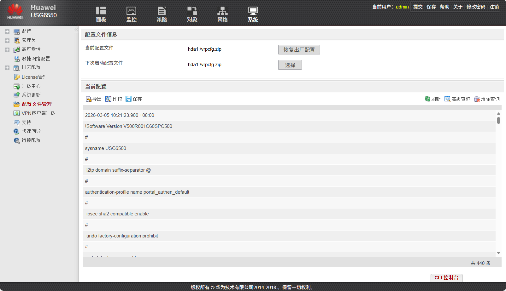
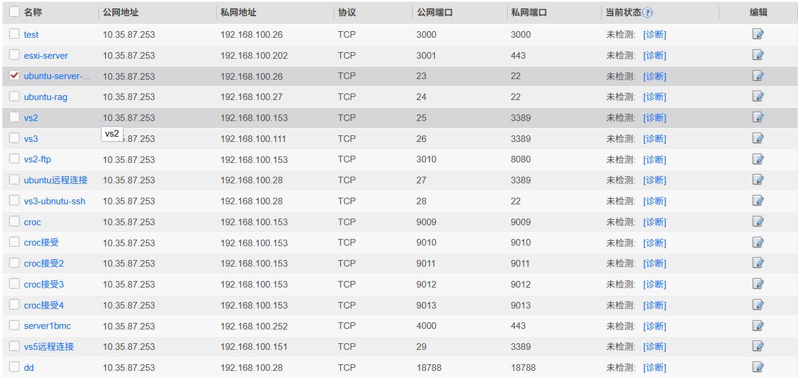

公网IP地址27.185.79.10

## 端口转发

| 公网端口 |       私网IP和端口        |         服务名         |
| :--: | :------------------: | :-----------------: |
|  23  |  192.168.100.26:22   |  ubuntu-server-ssh  |
|  24  |  192.168.100.27:22   |   ubuntu-rag-ssh    |
|  25  | 192.168.100.153:3389 |      vs2-远程桌面       |
|  27  |  192.168.100.28:27   |   ubuntu-vs3-远程桌面   |
|  28  |  192.168.100.28:28   |   ubuntu-vs3-ssh    |
| 3000 | 192.168.100.26:3000  | ubuntu-server-gitea |
| 3001 | 192.168.100.202:443  |      esxi管理平台       |
| 4000 | 192.168.100.252:443  |      超微服务器-BMC      |

## 导出配置

