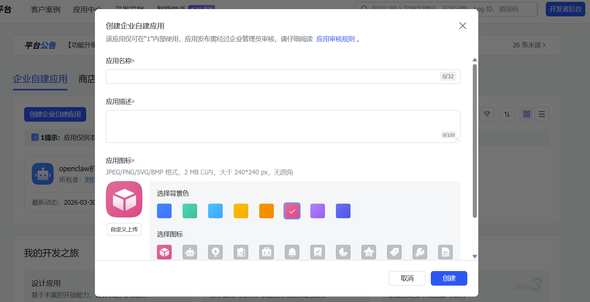
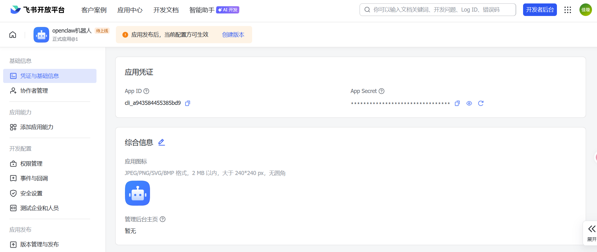

## 安装所需环境

### Nvm

下载Nvm安装程序
`https://gh-proxy.org/https://github.com/coreybutler/nvm-windows/releases/download/1.2.2/nvm-setup.zip`
解压后安装

### Nodejs

安装Nvm后打开Powershell
`nvm install 22`
使用Nodejs
`nvm use 22`

## Openclaw

`npm install -g openclaw@latest`

## 配置OpenClaw

验证是否安装成功
`openclaw --version`
运行配置引导
`openclaw onboard`

先跳过其他设置只在模型提供者`Model/auth provider`选择Ollama
地址为`http://27.185.79.10:11434`

## 连接飞书平台

