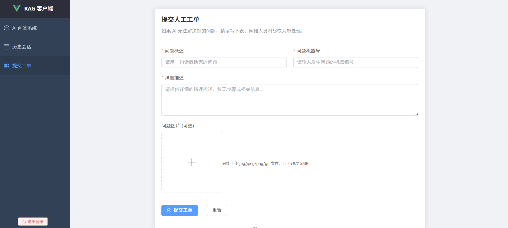
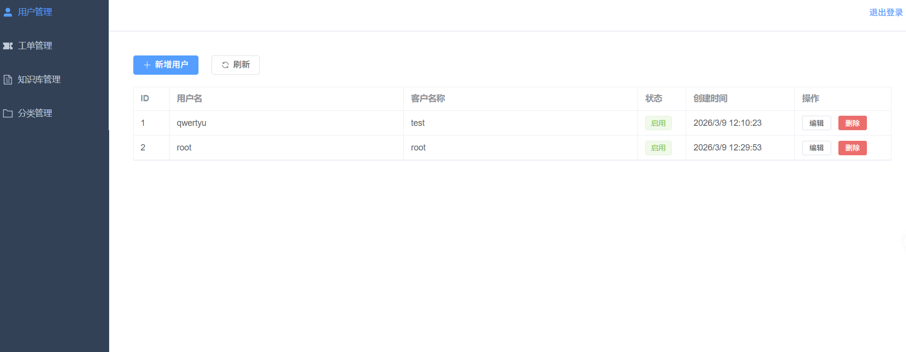
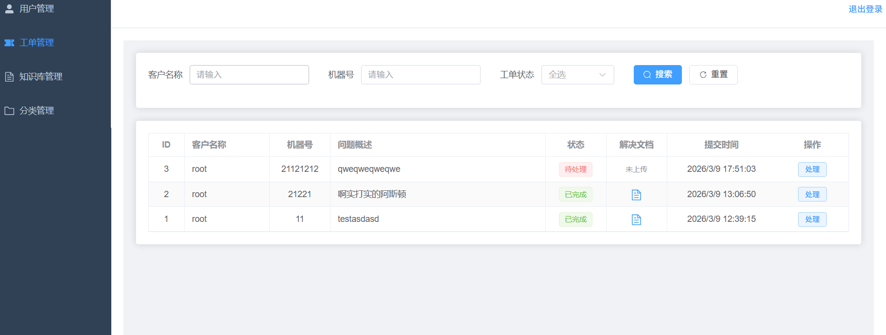
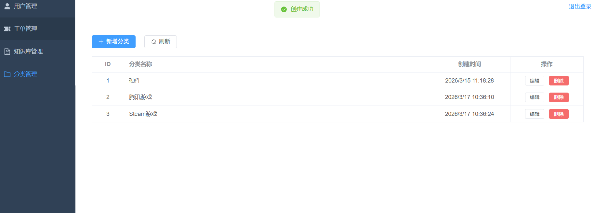
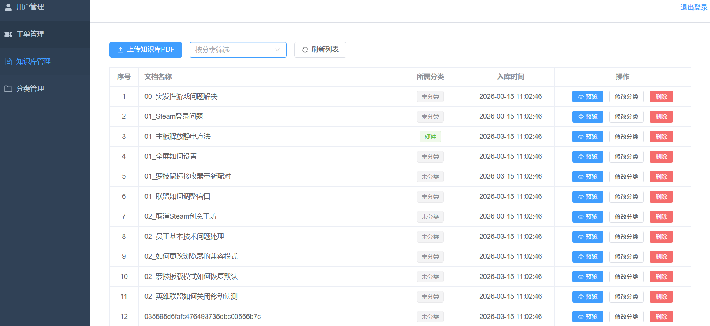

## RAG系统

### 客户端

问答系统：用户提出问题，通过RAG系统查询知识库给出回答，并将文档返回

历史会话：查看用户之前提问的问题

提交工单：当问题无法在知识库中检索到有用的信息时，填写问题详细信息有后台工作人员处理

### 管理端

用户管理：管理客户端的用户信息，供多个用户使用，可以创建，修改，删除用户

工单管理：后台工作人员查看未处理的工单，可以将处理后的文档同时上传至RAG系统

分类管理：可以为知识库创建和管理分类便于对知识库的管理

知识库管理：可以管理知识库文件