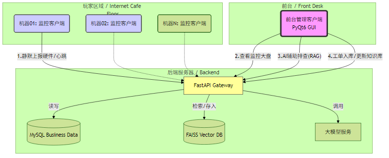
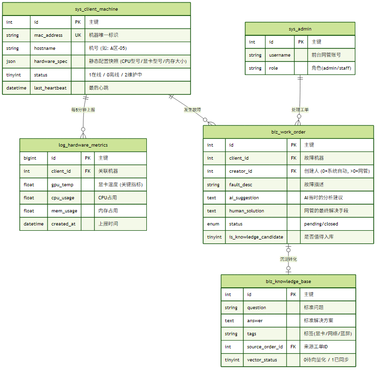

## 需求分析

---
# 网吧智能运维与知识库系统需求分析文档

## 1. 项目概述

本系统旨在构建一套基于 C/S 架构的网吧智能化运维平台。通过部署轻量级客户端采集终端硬件信息，结合服务端的大语言模型（LLM）与检索增强生成（RAG）技术，辅助网管快速定位并解决机器故障，同时实现故障处理流程的数字化与知识沉淀的自动化。



## 2. 角色定义

- **监控探针 (Monitor Agent)**：安装在网吧客户机上，负责数据采集与上报（无界面/托盘）。
    
- **运维工作台 (Admin Station)**：安装在前台/网管电脑上，用于监控大盘、AI 问答与工单处理（GUI 界面）。
    
- **智能中台 (Backend & AI)**：负责数据处理、向量检索、推理回答及业务逻辑。
    

## 3. 功能需求 (Functional Requirements)

### 3.1 核心模块：RAG 智能问答 (The Brain)

- **F-01 本地知识库检索**：系统需支持导入网吧维护手册、常见故障列表，并利用 FAISS/Chroma 进行向量化存储。
    
- **F-02 语境感知问答**：当针对特定机器提问时（如“05号机为何卡顿”），AI 需自动读取该机器最新的硬件日志（CPU/GPU/温度），结合知识库生成针对性建议。
    
- **F-03 多模态交互**：支持以自然语言（文字）形式进行多轮对话，提供故障排查步骤。
    

### 3.2 业务模块：故障闭环与知识沉淀 (The Loop)

- **F-04 自动/手动工单升级**：
    
    - 当 AI 回答被标记为“无效”或用户主动点击“转人工”时，系统自动生成工单。
        
    - 工单内容需包含：故障描述、机器快照、AI 初步诊断记录。
        
- **F-05 维护通知机制**：支持通过短信、邮件或管理端弹窗，实时通知值班维护人员处理未解决工单。
    
- **F-06 知识库自动化回填**：
    
    - 维护人员在解决工单后，**必须**填写解决方案。
        
    - 系统需提供“一键入库”功能，将“故障现象 + 最终解决方案”清洗后自动向量化，更新至 RAG 知识库，实现“越用越聪明”。
        

### 3.3 支撑模块：终端信息采集 (The Eyes)

- **F-07 硬件资产扫描**：自动采集 CPU 型号、内存大小、显卡型号、硬盘序列号、驱动版本等静态信息。
    
- **F-08 实时状态监控**：定时（如每5分钟）上报 CPU 使用率、显卡温度、显存占用等动态指标。
    
- **F-09 异常主动上报**：当检测到关键硬件异常（如显卡掉驱动、温度超过90度、硬盘 SMART 报错）时，立即触发报警。
    

## 4. 业务流程图 (Logic Flow)

为了更清晰地表达“知识库补充”的逻辑，以下是核心业务流程：

代码段

```
graph TD
    A[故障发生/发现] --> B{AI能否解决?}
    
    B -- 是 (Yes) -->  D[结束]
    
    B -- 否 (No) --> E[生成运维工单]
    E --> F[通知维护人员介入]
    F --> G[远程解决]
    G --> H[在系统录入解决方案]
    H --> I{是否具备通用性?}
    
    I -- 是 --> J[系统自动向量化]
    J --> K[(存入 RAG 本地知识库)]
    K --> L[下次遇到类似问题 AI 可直接回答]
    I -- 否 --> D
```


## 5. 非功能性需求 (Non-Functional Requirements)

### 5.1 性能要求 (Performance)

- **监控端资源占用**：监控探针在客户机上的 CPU 占用率不得超过 **1%**，内存占用不得超过 **50MB**，严禁影响客户游戏体验（FPS）。
    
- **响应速度**：AI 问答的首字生成延迟应小于 **2秒**。
    

### 5.2 安全性 (Security)

- **设备鉴权**：监控端与服务端通信需采用 Token 机制，防止非法设备伪造数据接入。
    
- **数据隔离**：不同网吧（如果未来做多店）的数据需逻辑隔离。
    

### 5.3 稳定性 (Stability)

- **断网续传**：监控端在网络抖动时应具备简单的重试机制，保持心跳连接。
    
- **自愈能力**：客户端进程崩溃后应能通过看门狗（Watchdog）自动重启。
    

---

### 下一步建议

这份文档已经具备了**项目章程**的雏形。基于此，你可以开始进行：

1. **数据库设计**（对应 F-04, F-06, F-07）。
    
2. **API 接口定义**（对应 F-01 到 F-09）。
    
3. **原型图绘制**（设计运维工作台的 UI）。

## 技术选型

### 1. 系统架构图 (Conceptual)

- **ClientA (监控哨兵):** 硬件信息采集。
	
- **ClientB (管理中台):** 负责用户交互、问题上报。 
    
- **Server (中心服务器):** 负责 AI 推理、RAG 检索、业务逻辑、通知分发。
    
- **Admin (运维管理端):** 这是一个 Web 端，供维护人员查看报警、管理知识库。
    

---

### 2. 详细技术选型清单

#### A. 客户端 (Client) 

##### 🖥️ 客户端 A：监控哨兵 (Monitor Agent)

- **部署位置**：网吧所有客户机。
    
- **形态**：**无界面（Headless）** 或 **托盘程序**。Windows 服务形式运行。
    
- **核心职责**：
    
    1. **静默采集**：开机自动启动，每 5-10 分钟上报一次 CPU、显卡型号、温度、驱动版本。
        
    2. **心跳保活**：告诉服务器“我还活着”。
        
    3. **被动指令执行**：接收来自前台的简单指令（如：截取当前屏幕发给前台、重启进程）。
        
- **技术关键**：
    
    - 使用 `Nuitka` 打包成无控制台的后台进程。
        
    - 资源占用必须极低（CPU < 1%），否则玩游戏卡顿会被投诉。
        

##### 💻 客户端 B：管理中台 (Admin Station)

- **部署位置**：网吧吧台/网管电脑。
    
- **形态**：**全功能桌面应用 (PyQt6)**。
    
- **核心职责**：
    
    1. **AI 智能助手**：网管遇到不懂的问题，在这里问 AI。
        
    2. **工单闭环 (关键逻辑)**
	    
        - **处理**：网管点击报警 -> AI 自动分析硬件日志给出建议。
            
        - **归档**：管理人员，点击“**解决并存入知识库**”，系统将“故障现象+硬件环境+解决方案”自动向量化存入系统。

#### B. 后端服务 (Server) - AI与业务中台

- **Web 框架:** **FastAPI**
    
    - **理由:** 高性能，原生支持异步（Async），非常适合处理 AI 模型的流式输出（Streaming Response），让用户感觉响应很快。
        
- **通信协议:** **HTTP (RESTful) + WebSocket**
    
    - **理由:** 常规请求用 HTTP；AI 对话使用 WebSocket，可以实现“打字机效果”，提升用户体验。
        

#### C. AI 与 RAG 核心 (The Brain)

这是项目的核心部分。

- **大模型编排:** **LangChain**
    
    - **理由:** 事实上的行业标准。你可以用它轻松构建“检索-增强-生成”的链路，管理 Prompt 和上下文历史。
        
- **向量数据库:** **FAISS (本地文件版) 或 ChromaDB**
    
    - **理由:** 考虑到知识库主要针对网吧业务，数据量不会达到亿级。FAISS 极其轻量，可以直接嵌入在服务端代码中，无需使用milvus单独维护一个庞大的向量数据库服务。
        
- **Embedding 模型:** **BGE-M3 或 OpenAI text-embedding-3-small**
    
    - **理由:** 中文语义理解能力强，检索准确率高。
        
- **LLM 模型:**
	
    - _方案一(私有化):_ **Ollama + Qwen2.5-14B** 。
        

#### D. 数据存储与运维

- **关系型数据库:** **MySQL 8.0**
    
    - **理由:** 存储机器信息、用户对话日志、工单状态。结构化数据的不二之选。
        
- **任务队列:** **Redis (可选)**
    
    - **理由:** 如果需要异步发送邮件/短信通知维护人员，或者处理大量的机器信息上报，Redis 可以作为缓冲。
        

#### E. 运维管理端 (Admin Dashboard)

通过Web 页面方便管理知识库。

- **前端框架:** **Vue 3 + Element Plus**
    
    - **理由:** 开发后台管理系统最快的组合。维护人员可以通过浏览器登录，查看无法解决的问题，手动回复并点击“加入知识库”。
        

---

### 3. 核心业务流程设计 (RAG Loop)

1. **用户提问:** 客户端通过 WebSocket 发送问题。
    
2. **RAG 检索:** LangChain 在 FAISS 中检索相似文档。
    
3. **AI 回答:** LLM 结合检索结果生成回答。
    
    - _分支 A (解决):_ 用户点赞，对话结束。
        
    - _分支 B (未解决):_ 用户点击“转人工/未解决”。
        
4. **自动工单 (Escalation):**
    
    - 系统将该问题 + AI的回答 + **收集到的机器硬件信息** 打包存入 MySQL。
        
    - 通过 API 调用短信/邮件接口，**通知维护人员**。
        
5. **人工介入与回填 (Human-in-the-loop):**
    
    - 通过短信，邮件等方式通知维护人员。
        
    - 维护人员在 Web 端看到工单处理问题并填写标准解决方案。
        
    - **关键一步:** 系统自动将“问题 + 人工标准答案”向量化，**插入 FAISS 知识库**。
        
    - 下次有人问同样问题，AI 就能直接回答了。
        

## API文档

---
### 📡 接口基础约定

* **鉴权方式**： Bearer Token (JWT)

- 所有非登录接口，必须在 Header 中携带: `Authorization: Bearer <your_access_token>`

- **Base URL**: `http://<服务器IP>:8000/api/v1`
    
- **数据格式**: JSON
    
- **通用响应结构**:
    
    JSON
    
    ```
    {
      "code": 200,      // 200成功，其他为错误码
      "msg": "success", // 提示信息
      "data": {}        // 具体业务数据
    }
    ```
    

---

### 0. 🔐 身份认证模块 (Auth)

本模块负责发放访问令牌（Token）。FastAPI 原生支持 OAuth2 密码模式，非常适合此场景。

#### 0.1 管理员登录 (Web端/运维端)

- **URL**: `/auth/admin/login`
    
- **Method**: `POST`
    
- **Content-Type**: `application/x-www-form-urlencoded` (FastAPI `OAuth2PasswordRequestForm` 标准格式) 或 `application/json`
    
- **描述**: 运维人员通过账号密码登录，获取 Token 用于管理知识库和查看工单。
    
- **Request Body**:
    
    JSON
    
    ```
    {
      "username": "admin",
      "password": "secret_password"
    }
    ```
    
- **Response**:
    
    JSON
    
    ```
    {
      "code": 200,
      "data": {
        "access_token": "eyJhbGciOiJIUzI1Ni...", // JWT 字符串
        "token_type": "bearer",
        "expires_in": 86400, // 24小时过期
        "user_info": {
            "id": 1,
            "role": "admin",
            "name": "超级管理员"
        }
      }
    }
    ```
    

#### 0.2 客户端设备注册/登录 (Client端 )

- **URL**: `/auth/client/login`
    
- **Method**: `POST`
    
- **描述**: 前台通过分配的账号登录系统。
    
- **Request Body**:
    
    JSON
    
    ```
    {
      "wangba_id": "xx网吧", // 客户地址
      "hostname": "ZONE-A-001",          // 机器名，方便网管识别位置
      "secret_key": "netbar_v1_secret",  // (可选) 客户端硬编码的一个简单密钥，防止恶意脚本随便调用
      "ip_address": "192.168.1.101"      // 当前内网IP
    }
    ```
    
- **Response**:
    
    JSON
    
    ```
    {
      "code": 200,
      "msg": "设备认证成功",
      "data": {
        "access_token": "eyJhbGciOiJIUzI1Ni...", // 设备专用 Token
        "config": {
            "heartbeat_interval": 60, // 告诉客户端：每60秒发一次心跳/硬件监控
            "allow_chat": true        // 远程控制开关：是否允许使用AI助手
        }
      }
    }
    ```

### 1. 🤖 AI 对话模块 (核心 RAG)

#### 1.1 发起对话 (HTTP版)

- **URL**: `/chat/ask`
    
- **Method**: `POST`
    
- **描述**: 客户端发送问题，获取 AI 回答（等待时间较长）。
    
- **Request Body**:
    
    JSON
    
    ```
    {
      "client_id": "PC-001",    // 机器编号
      "session_id": "uuid-...", // 会话ID (用于保持多轮对话上下文)
      "question": "我的电脑玩LOL掉帧怎么办？"
    }
    ```
    
- **Response**:
    
    JSON
    
    ```
    {
      "code": 200,
      "data": {
        "answer": "玩LOL掉帧可能是显卡驱动问题...",
        "source": ["知识库文档A.txt", "维护手册_V2.pdf"] // 引用来源，增强可信度
      }
    }
    ```
    

#### 1.2 建立流式对话 (WebSocket版 - 推荐)

- **URL**: `ws://<服务器IP>:8000/ws/chat/{client_id}`
    
- **描述**: 建立长连接，实现打字机效果。
    
- **流程**:
    
    1. 客户端发送 JSON: `{"question": "..."}`
        
    2. 服务端分片返回: `{"type": "token", "content": "玩"}` -> `{"type": "token", "content": "LOL"}` ...
        
    3. 服务端发送结束: `{"type": "end"}`
        

---

### 2. 🛠️ 运维工单模块 (问题升级)

当 AI 无法解决问题时，客户端调用此接口通知维护人员。

#### 2.1 提交人工工单

- **URL**: `/ticket/create`
    
- **Method**: `POST`
    
- **描述**: 记录问题详情，并触发短信/邮件通知维护人员。
    
- **Request Body**:
    
    JSON
    
    ```
    {
      "client_id": "PC-001",
      "description": "AI没解决，屏幕一直闪烁",
      "chat_history_summary": "用户询问屏幕闪烁，AI建议重启，无效。", // 可选，由AI自动总结上下文
      "urgent_level": "high" // high/normal
    }
    ```
    
- **Response**:
    
    JSON
    
    ```
    {
      "code": 200,
      "msg": "已通知网管，请稍候",
      "data": {
        "ticket_id": 1024
      }
    }
    ```
    

---

### 3. 🖥️ 硬件监控模块 (信息收集)

客户端定期（如每10分钟）或在启动时上报硬件状态。

#### 3.1 上报硬件信息

- **URL**: `/hardware/report`
    
- **Method**: `POST`
    
- **Request Body**:
    
    JSON
    
    ```
    {
      "client_id": "PC-001",
      "os_version": "Windows 11",
      "cpu": {
        "model": "Intel i5-12400F",
        "usage_percent": 15.5
      },
      "memory": {
        "total_gb": 16,
        "used_percent": 45.0
      },
      "gpu": {
        "name": "NVIDIA GeForce RTX 3060",
        "temperature": 65,  // 显卡温度，网吧重点关注
        "driver_version": "536.23"
      },
      "network": {
        "ip": "192.168.1.101",
        "mac": "00:1A:2B:3C:4D:5E"
      }
    }
    ```
    

---

### 4. 📚 知识库管理模块 (运维端 Web 使用)

#### 4.1 补充知识库 (反馈闭环)

- **URL**: `/knowledge/add`
    
- **Method**: `POST`
    
- **描述**: 维护人员解决问题后，将“问题+标准答案”录入系统。**后端会自动调用 Embedding 模型将其向量化存入 FAISS。**
    
- **Request Body**:
    
    JSON
    
    ```
    {
      "question": "玩吃鸡提示显存不足",
      "answer": "请在设置中将虚拟内存调整为自动管理，并检查是否开启了多余的后台程序。",
      "category": "游戏故障",
      "source_ticket_id": 1024 // 关联之前的工单ID
    }
    ```
    

#### 4.2 查看待处理工单列表

- **URL**: `/ticket/list`
    
- **Method**: `GET`
    
- **Parameters**: `?status=pending` (只看未解决的)
    
- **Response**:
    
    JSON
    
    ```
    {
      "code": 200,
      "data": [
        {
          "ticket_id": 1024,
          "client_id": "PC-001",
          "description": "屏幕闪烁",
          "create_time": "2023-10-27 14:00:00"
        }
      ]
    }
    ```
    
---
## 表结构

基于“监控端（Monitor）+ 管理端（Admin）”分离的新架构，以及对**故障闭环**（Ticket -> Knowledge）的强化需求，我重新设计了数据库结构。

这次设计的核心原则是：**动静分离**。

- **静态数据**（机器配置、MAC地址）存主表。
    
- **动态数据**（温度、占用率）存日志表。
    
- **业务数据**（工单、知识）存业务表。
    

### 📊 1. 实体关系图 (New ER Diagram)

这张图展示了监控端如何上报数据，以及管理员如何通过工单系统将故障转化为知识。

代码段



---

### 📝 2. SQL 建表语句 (优化版)

#### A. 基础资源表 (System)

SQL

```
-- 1. 网管/管理员表 (用于前台管理端登录)
CREATE TABLE `sys_admin` (
  `id` int UNSIGNED NOT NULL AUTO_INCREMENT,
  `username` varchar(50) NOT NULL COMMENT '登录账号',
  `password_hash` varchar(255) NOT NULL,
  `role` enum('super_admin','staff') DEFAULT 'staff',
  `created_at` datetime DEFAULT CURRENT_TIMESTAMP,
  PRIMARY KEY (`id`),
  UNIQUE KEY `uk_username` (`username`)
) ENGINE=InnoDB COMMENT='前台管理人员表';

-- 2. 客户机资产表 (存放静态信息)
-- 监控端启动时，对比这里的mac_address，如果不存在则自动注册
CREATE TABLE `sys_client_machine` (
  `id` int UNSIGNED NOT NULL AUTO_INCREMENT,
  `mac_address` varchar(64) NOT NULL COMMENT '物理MAC地址(唯一凭证)',
  `hostname` varchar(50) DEFAULT NULL COMMENT '主机名/台号 (例如: A-01)',
  `ip_address` varchar(20) DEFAULT NULL COMMENT '当前内网IP',
  
  -- 关键点：使用 JSON 存储硬件配置快照。
  -- 优点：以后如果显卡驱动更新了，或者加了内存，直接覆盖这个字段即可，不用改表结构。
  `hardware_spec` json DEFAULT NULL COMMENT '配置快照: {"gpu": "RTX3060", "cpu": "i5-12400", "ram": "16GB", "driver": "535.98"}',
  
  `status` tinyint DEFAULT 1 COMMENT '1:在线, 0:离线, 2:报警中',
  `last_heartbeat` datetime DEFAULT NULL COMMENT '最后活跃时间',
  PRIMARY KEY (`id`),
  UNIQUE KEY `uk_mac` (`mac_address`),
  KEY `idx_status` (`status`)
) ENGINE=InnoDB COMMENT='网吧终端资产表';
```

#### B. 动态监控表 (Logs)

SQL

```
-- 3. 硬件监控流水表
-- 只有监控端上报的数据会进这里，数据量极大，建议按月分表或定期清理
CREATE TABLE `log_hardware_metrics` (
  `id` bigint UNSIGNED NOT NULL AUTO_INCREMENT,
  `client_id` int UNSIGNED NOT NULL,
  
  -- 核心监控指标 (数值型，方便画图)
  `gpu_temp` decimal(5,2) DEFAULT NULL COMMENT '显卡温度',
  `gpu_load` decimal(5,2) DEFAULT NULL COMMENT '显卡占用率%',
  `cpu_load` decimal(5,2) DEFAULT NULL COMMENT 'CPU占用率%',
  `mem_usage` decimal(5,2) DEFAULT NULL COMMENT '内存占用率%',
  
  `created_at` datetime DEFAULT CURRENT_TIMESTAMP,
  PRIMARY KEY (`id`),
  KEY `idx_client_time` (`client_id`, `created_at`) -- 联合索引，用于查询"某台机器最近1小时的温度曲线"
) ENGINE=InnoDB COMMENT='硬件监控流水';
```

#### C. 业务闭环表 (Business)

SQL

```
-- 4. 故障工单表 (连接故障与知识的桥梁)
CREATE TABLE `biz_work_order` (
  `id` int UNSIGNED NOT NULL AUTO_INCREMENT,
  `client_id` int UNSIGNED NOT NULL COMMENT '关联故障机器',
  `creator_id` int UNSIGNED DEFAULT 0 COMMENT '0=系统自动报警生成, >0=管理员手动创建',
  
  `fault_desc` varchar(255) NOT NULL COMMENT '故障现象 (如: 玩黑神话频繁闪退)',
  `error_code` varchar(50) DEFAULT NULL COMMENT '错误代码 (如: GPU_Code_43)',
  
  -- AI 辅助部分
  `ai_analysis_snapshot` text COMMENT '记录当时AI给出的建议，用于后续复盘AI准不准',
  
  -- 人工处理部分
  `human_solution` text COMMENT '【关键】网管最终是如何解决的',
  `status` enum('pending','processing','closed') DEFAULT 'pending',
  
  -- 知识库转化标记
  `is_knowledge_candidate` tinyint DEFAULT 0 COMMENT '1=解决了疑难杂症，建议入库',
  
  `created_at` datetime DEFAULT CURRENT_TIMESTAMP,
  `updated_at` datetime ON UPDATE CURRENT_TIMESTAMP,
  PRIMARY KEY (`id`),
  KEY `idx_status` (`status`)
) ENGINE=InnoDB COMMENT='运维工单表';

-- 5. 知识库表 (RAG 数据源)
CREATE TABLE `biz_knowledge_base` (
  `id` int UNSIGNED NOT NULL AUTO_INCREMENT,
  `question` varchar(255) NOT NULL COMMENT '标准问题',
  `answer` text NOT NULL COMMENT '标准答案 (Markdown格式)',
  `tags` varchar(100) DEFAULT NULL COMMENT '标签 (逗号分隔)',
  
  -- 溯源
  `source_order_id` int UNSIGNED DEFAULT NULL COMMENT '来源工单ID，方便追溯是哪次维修总结出来的',
  
  -- 向量化状态
  `vector_status` tinyint DEFAULT 0 COMMENT '0:未同步到FAISS, 1:已同步, 2:同步失败',
  `updated_at` datetime DEFAULT CURRENT_TIMESTAMP ON UPDATE CURRENT_TIMESTAMP,
  PRIMARY KEY (`id`),
  FULLTEXT KEY `ft_qa` (`question`, `answer`) -- 简单的全文索引，作为向量检索的兜底
) ENGINE=InnoDB COMMENT='RAG本地知识库';
```

---

### 🌟 3. 针对新需求的各种场景设计

#### 场景 1：监控端静默上报与注册

- **动作**：机器开机，监控端启动。
    
- **逻辑**：
    
    1. 监控端读取本机 MAC 地址。
        
    2. 调用 `POST /api/client/heartbeat`。
        
    3. 服务端检查 `sys_client_machine` 是否有此 MAC？
        
        - **无**：插入一条新记录，解析 Payload 中的 `hardware_spec` (CPU/GPU型号) 存入 JSON 字段。
            
        - **有**：仅更新 `last_heartbeat` 和 `ip_address`。
            
    4. 同时，将温度负载数据写入 `log_hardware_metrics`。
        

#### 场景 2：前台“回答问题后的逻辑” (知识沉淀)

这是你需求中最重要的部分。

- **动作**：网管处理完一个工单（比如换了驱动解决了闪退）。
    
- **逻辑**：
    
    1. 网管在管理端找到该工单，填写 `human_solution`：“卸载旧驱动，安装 536.23 版本”。
        
    2. 勾选界面上的 ✅ **“加入知识库”**。
        
    3. 点击“结单”。
        
    4. 后端做两件事：
        
        - 更新 `biz_work_order` 状态为 `closed`。
            
        - **自动插入** `biz_knowledge_base`：
            
            - `question` = 工单的 `fault_desc` ("玩黑神话频繁闪退")
                
            - `answer` = 工单的 `human_solution` ("卸载旧驱动，安装 536.23 版本")
                
            - `source_order_id` = 当前工单ID。
                
            - `vector_status` = 0 (等待后台任务向量化)。
                

#### 场景 3：收集信息 (JSON 的妙用)

- 为什么用 JSON 存 `hardware_spec`？
    
- 因为网吧机器配置经常变。
    
- 如果哪天你想多采集一个“显示器型号”，不需要修改数据库表结构，只需要修改客户端采集脚本，服务端照单全收存入 JSON 即可。
    
    - 数据样例：`{"cpu": "i5-12400F", "gpu": "RTX 3060", "monitor": "AOC 27 inch", "driver": "531.11"}`


## 目录结构

```
NetBar-AI-Ops/
├── docs/                       # 项目文档 (需求文档, API文档, 设计图)
├── scripts/                    # 运维脚本 (部署, 数据备份, 初始化)
├── docker-compose.yml          # 容器编排 (MySQL, Redis, Server)
├── README.md                   # 项目总说明
│
├── 📂 server/                  # [核心] 后端服务 (FastAPI + LangChain)
│   ├── app/
│   │   ├── api/                # 路由层 (Endpoints)
│   │   │   ├── v1/
│   │   │   │   ├── auth.py     # 认证接口 (对应 0.1, 0.2)
│   │   │   │   ├── chat.py     # AI 对话接口 (对应 1.1, 1.2)
│   │   │   │   ├── hardware.py # 硬件上报接口 (对应 3.1)
│   │   │   │   ├── ticket.py   # 工单接口 (对应 2.1)
│   │   │   │   └── knowledge.py# 知识库接口 (对应 4.1)
│   │   │
│   │   ├── core/               # 核心配置
│   │   │   ├── config.py       # 环境变量加载 (.env)
│   │   │   ├── security.py     # JWT 生成与校验
│   │   │   └── events.py       # 启动/关闭事件处理
│   │   │
│   │   ├── db/                 # 数据库层
│   │   │   ├── session.py      # SQLAlchemy Session
│   │   │   └── base.py         # ORM Base
│   │   │
│   │   ├── models/             # SQL 模型 (对应数据库表结构)
│   │   │   ├── user.py         # sys_admin
│   │   │   ├── asset.py        # sys_client_machine
│   │   │   ├── log.py          # log_hardware_metrics
│   │   │   └── business.py     # biz_work_order, biz_knowledge_base
│   │   │
│   │   ├── schemas/            # Pydantic 数据验证模型 (DTO)
│   │   │   ├── hardware.py     # 硬件信息校验
│   │   │   └── ticket.py       # 工单数据校验
│   │   │
│   │   ├── services/           # 业务逻辑层
│   │   │   ├── hardware_srv.py # 处理硬件数据清洗、报警判断
│   │   │   └── ticket_srv.py   # 工单流转逻辑
│   │   │
│   │   ├── rag/                # [核心] RAG 引擎 (The Brain)
│   │   │   ├── chain.py        # LangChain 编排逻辑
│   │   │   ├── embeddings.py   # 向量模型加载 (BGE-M3)
│   │   │   ├── vector_store.py # FAISS 读写封装
│   │   │   └── prompts.py      # 提示词模板管理
│   │   │
│   │   └── main.py             # FastAPI 入口
│   │
│   ├── faiss_index/            # 本地向量数据库文件存储 (.index, .pkl)
│   ├── alembic/                # 数据库迁移脚本
│   ├── requirements.txt        # 后端依赖 (fastapi, langchain, faiss-cpu, etc.)
│   └── Dockerfile              # 后端镜像构建
│
├── 📂 client_monitor/          # [客户端A] 监控哨兵 (Headless Python)
│   ├── src/
│   │   ├── collector/          # 硬件采集模块
│   │   │   ├── gpu.py          # NVIDIA SMI 调用
│   │   │   └── system.py       # psutil CPU/Mem 采集
│   │   ├── network/            # 网络通信
│   │   │   ├── http_client.py  # 鉴权与心跳上报
│   │   │   └── websocket.py    # 接收远程指令
│   │   ├── utils/              # 工具类 (日志, 加密)
│   │   └── main.py             # 启动入口 (包含 Watchdog 逻辑)
│   │
│   ├── dist/                   # Nuitka 打包后的产物
│   ├── build_script.py         # Nuitka 打包脚本
│   └── requirements.txt        # 客户端依赖 (psutil, requests, websocket-client)
│
├── 📂 client_admin_gui/        # [客户端B] 网管中台 (PyQt6 桌面端)
│   ├── assets/                 # 图标, 样式表 (QSS)
│   ├── src/
│   │   ├── ui/                 # 界面层
│   │   │   ├── main_window.py  # 主窗口
│   │   │   ├── chat_widget.py  # AI 聊天组件
│   │   │   └── alert_dialog.py # 报警弹窗
│   │   ├── controllers/        # 逻辑控制层
│   │   │   └── chat_ctrl.py    # 处理 WebSocket 流式消息
│   │   ├── api/                # API 客户端封装
│   │   └── main.py             # 程序入口
│   │
│   └── requirements.txt        # 依赖 (PyQt6, aiohttp)
│
└── 📂 web_admin/               # [Web端] 运维管理后台 (Vue3 + Element Plus)
    ├── src/
    │   ├── api/                # Axios 请求封装
    │   ├── views/
    │   │   ├── Dashboard.vue   # 大盘数据
    │   │   ├── TicketList.vue  # 工单处理页
    │   │   └── Knowledge.vue   # 知识库管理页
    │   └── components/         # 公共组件
    │
    ├── package.json
    └── vite.config.js
```