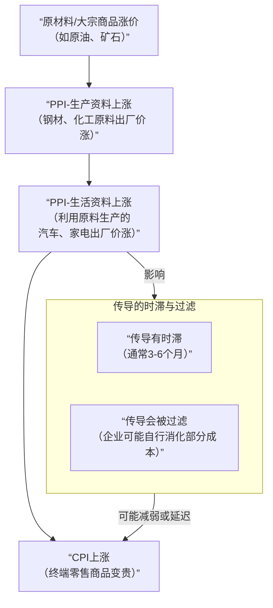

## 同比和环比

|对比项|**同比**|**环比**|
|---|---|---|
|**对比对象**|上一年的**同一时期**|**上一个相邻的时期**|
|**时间跨度**|通常是一整年|通常是一个月或一个季度|
|**主要目的**|消除季节性，看长期趋势|反映短期波动和近期变化|
|**例子**|2024年Q2 vs **2023年Q2**|2024年Q2 vs **2024年Q1**|
## CPI

### 核心定义

**CPI** 全称 **消费者价格指数**，英文是 **Consumer Price Index**。

它衡量的是**一篮子**与居民生活相关的**商品和服务**的**价格水平**，在一段时期内（通常是月度、年度）的平均变化。简单说，它就是用来反映**通货膨胀或通货紧缩**程度的核心指标。

**通俗理解：CPI 就是“物价指数”，它告诉我们，老百姓过日子买的东西，总体上变贵了还是变便宜了，以及贵了多少。**

---

### 关键要点详解

1.  **“一篮子”商品和服务**
    *   统计局不会只跟踪少数几样东西的价格，而是会选取成百上千种能代表居民典型消费模式的商品。这一篮子通常包括：
        *   **食品烟酒**（如粮食、蔬菜、肉类）
        *   **衣着**
        *   **居住**（如房租、水电燃料、物业管理费，但**通常不包括房价**本身，因为房价属于投资品）
        *   **生活用品及服务**
        *   **交通和通信**
        *   **教育、文化和娱乐**
        *   **医疗保健**
        *   **其他用品及服务**
    *   每种商品在“篮子”里都有一个**权重**，权重根据其在居民总消费中的重要性来确定。例如，食品的权重通常比烟酒高。

2.  **如何计算？**
    *   首先确定一个**基期**（比如以某一年为基准，设定其CPI为100）。
    *   然后追踪这一篮子商品在**当前时期**的总成本。
    *   计算公式为：
        `CPI = （当前一篮子商品和服务的总成本 / 基期一篮子商品和服务的总成本） × 100`
    *   我们更常关注的是**CPI同比**（即今年本月 vs 去年同月）或**CPI环比**（即本月 vs 上月）的**增长率**，也就是我们常听到的 **“CPI涨幅”**。

---

### 一个简化例子

假设居民的“一篮子”商品只有三种：大米、猪肉、公交车票。基期（去年）它们的价格和消费量如下：

| 商品     | 单价（基期） | 消费量（权重） | 基期成本 |
| :------- | :----------- | :------------- | :------- |
| 大米     | 5元/公斤     | 10公斤         | 50元     |
| 猪肉     | 30元/公斤    | 2公斤          | 60元     |
| 公交车票 | 2元/次       | 20次           | 40元     |
| **合计** | -            | -              | **150元**|

现在到了报告期（今年），价格变了：
*   大米：5.5元/公斤 （涨了10%）
*   猪肉：33元/公斤 （涨了10%）
*   公交车票：2.2元/次 （涨了10%）

那么报告期的总成本 = `5.5*10 + 33*2 + 2.2*20` = 55 + 66 + 44 = **165元**

**CPI指数** = `(165 / 150) * 100 = 110`
**CPI同比涨幅** = `(110 - 100) / 100 * 100% = 10%`

这意味着，从整体上看，居民的这“一篮子”消费成本比去年同一时期上涨了10%。

---

### 为什么CPI如此重要？

1.  **衡量通胀/通缩的标尺**：
    *   **CPI > 0**，表示物价总体上涨（通货膨胀）。
    *   **CPI < 0**，表示物价总体下降（通货紧缩，可能更危险）。
    *   通常，温和的通货膨胀（如2%-3%）被视为经济健康的标志。

2.  **影响宏观政策**：
    *   **央行（如中国人民银行、美联储）制定货币政策（如加息、降息）最重要的依据之一。** 如果CPI过高，央行可能加息来抑制通胀；反之则可能降息刺激经济。

3.  **调整社会福利和薪酬**：
    *   许多国家的养老金、低保金、最低工资标准等，会与CPI挂钩，定期调整，以保证民众生活水平不因物价上涨而下降。

4.  **影响实际利率和投资**：
    *   **实际利率 = 名义利率 - CPI涨幅**。
    *   如果银行存款利率是2%，而CPI涨幅是3%，那么你的钱存在银行的实际购买力是在缩水的（实际利率为-1%）。这会影响人们的储蓄和投资决策。

---

### 常见误解与局限

*   **CPI ≠ 个人感受**：CPI反映的是**全国**、**平均**水平的物价变化。每个人的消费结构（“个人篮子”）不同。如果你最近主要消费的是房价、医疗、教育这些涨得快的项目，你的“个人CPI”感受就会比官方数据强烈得多。
*   **CPI不包含房价（作为投资）**：这一点常被诟病。CPI中的“居住”类主要计算**租金、水电燃料、装修材料**等，而**新房的购买价格**被视为投资，不计入CPI（但会体现在房地产价格指数中）。许多人觉得“房价涨疯了但CPI不高”，部分原因在此。
*   **替代效应**：当牛肉太贵时，人们会多买鸡肉。CPI计算中会考虑这种消费替代行为，以更真实地反映生活成本的变化。

### 总结

**CPI是衡量居民生活成本变化、监测宏观经济运行、并作为政府和企业决策关键依据的“物价晴雨表”。** 关注CPI数据，能帮助我们理解经济的冷热，并更好地规划个人财务。

## PPI

### 核心定义

**PPI** 全称 **生产者价格指数**，英文是 **Producer Price Index**。

它衡量的是**工业企业产品出厂价格**（即第一次出售时的价格）在某个时期内的变动趋势和程度。简单说，它反映的是**生产端、批发端**的成本和价格变化。

**通俗理解：CPI看的是“购物车里的商品贵不贵”，而PPI看的是“工厂生产这些商品的原材料和成品出厂时贵不贵”。**

---

### 关键要点详解

1.  **观察对象是“生产者”**
    *   PPI的调查对象是**工业企业**，而不是最终消费者。
    *   它跟踪的是产品离开工厂大门时的价格，即**出厂批发价**。这是产品进入流通领域（批发、零售）的第一个价格。

2.  **核心构成：两大分类**
    PPI通常包含两个主要部分，形成一个完整的链条：
    *   **生产资料（占比约70%-80%）**：用于进一步加工生产的商品。
        *   **采掘工业**：如原油、铁矿石。
        *   **原材料工业**：如钢材、水泥、化工原料。
        *   **加工工业**：如机械设备、零部件。
    *   **生活资料**：直接用于居民消费的商品。
        *   **食品类、衣着类、一般日用品类、耐用消费品类**（如汽车、家电）。

3.  **计算方法**
    *   与CPI类似，也是基于一篮子有代表性的工业品，根据其行业重要性赋予权重，通过加权平均计算得出指数和变化率。
    *   同样，我们最关注的是 **PPI同比**和 **PPI环比** 涨幅。

---

### PPI与CPI的核心关系：价格传导

这是理解PPI最重要的部分。价格在产业链上的传导路径通常是：
**原材料/大宗商品 → PPI生产资料 → PPI生活资料 → CPI**

用一个简化的链条来说明：
**国际原油价格上涨** → 国内化工企业**进货成本上升** → 化工企业生产的**塑料、化纤出厂价（PPI）上涨** → 服装厂用更贵的化纤生产衣服，家电厂用更贵的塑料生产外壳 → 服装、家电的**出厂价（PPI）上涨** → 零售商**进货成本上升** → 最终**商店售价（CPI）上涨**。

为了更直观地展示这个传导过程，请看下图：

这个过程存在两个关键特点：
*   **传导有时滞**：从PPI变动传导到CPI，通常需要3到6个月甚至更长时间。
*   **传导可能被过滤**：终端需求不足或企业竞争激烈时，生产企业可能通过压缩自身利润（“薄利多销”）来消化成本上涨，而不完全转嫁给消费者，导致PPI上涨未能完全传导至CPI。

---

### 为什么PPI如此重要？

1.  **通货膨胀的先行指标**：由于价格传导机制，PPI的变化通常**领先于CPI**。因此，PPI被视为判断未来CPI走势和整体通胀压力的**重要预警信号**。央行会密切关注PPI。

2.  **反映实体经济冷热**：
    *   **PPI持续上涨**：可能表明上游需求旺盛，经济处于扩张或过热阶段。
    *   **PPI持续下跌**：可能表明工业领域需求疲软，存在通缩压力，经济可能面临收缩风险。

3.  **揭示企业盈利压力**：观察 **“PPI-CPI剪刀差”** （即PPI同比涨幅减去CPI同比涨幅）非常有价值。
    *   **“剪刀差”为正（PPI > CPI）**：意味着上游原材料涨价快于下游终端产品涨价。**中下游制造业企业的利润空间被挤压**，因为它们难以将全部成本转嫁给消费者。
    *   **“剪刀差”为负（PPI < CPI）**：意味着下游消费需求较强，终端产品提价能力超过原材料涨价速度。**中下游企业的利润空间可能改善**。

4.  **受国际大宗商品价格影响大**：由于中国是制造业大国和原材料进口大国，PPI对国际油价、铁矿石、有色金属等大宗商品价格波动非常敏感，是观察 **“输入性通胀”** 的窗口。

---

### 与CPI的对比总结

| 对比维度 | **PPI（生产者价格指数）** | **CPI（消费者价格指数）** |
| :--- | :--- | :--- |
| **观察对象** | **生产者**（工业企业） | **消费者**（居民家庭） |
| **价格环节** | **出厂批发价**（流通起点） | **最终零售价**（流通终点） |
| **涵盖范围** | 全部工业产品（含中间产品） | 与居民生活直接相关的商品和服务 |
| **主要作用** | **通胀先行指标**，反映工业成本和实体经济冷热 | **通胀核心指标**，反映居民生活成本变化 |
| **关键联系** | PPI的变动**向CPI传导**，影响未来CPI走势 | CPI是PPI传导的最终结果之一 |

### 总结

**PPI是观察工业领域价格变动、预测未来通货膨胀趋势、分析企业盈利压力和宏观经济冷热的“温度计”和“预警器”。** 将PPI与CPI结合起来分析，可以更全面地理解价格在整个经济链条中的传导脉络，从而做出更准确的经济判断和投资决策。