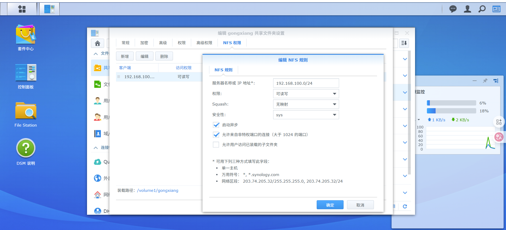

# 1. Nas上共享文件夹开启nfs


# 2. Linux挂载磁盘

配置参数如下：

- **NAS IP:** `192.168.100.195`
    
- **NAS 路径:** `/volume1/gongxiang`
    
- **本地挂载点:** `/mnt/nas_mnt`
    
---

## 第一步：安装 NFS 客户端工具

在挂载 NFS 共享之前，必须安装 `nfs-common` 包，否则系统无法识别 nfs 文件系统类型。

Bash

```
sudo apt update
sudo apt install nfs-common -y
```

## 第二步：创建挂载点

挂载点就是本地的一个空目录，NAS 的数据将“投影”到这个目录上。

Bash

```
# -p 参数确保如果目录已存在不会报错
sudo mkdir -p /mnt/nas_mnt
```

## 第三步：手动挂载测试 & 权限修正

在写入自动挂载配置文件之前，必须先手动测试连接是否正常。

**1. 执行挂载命令：**

Bash

```
sudo mount -t nfs 192.168.100.195:/volume1/gongxiang /mnt/nas_mnt
```

_如果不报错，说明连接成功。_

**2. 修正读写权限 (针对“不映射”模式)：**

由于你在 NAS 端选择了 **“不映射 (No Mapping)”**，需要通过 Root 权限放开本地目录的限制，以便普通用户可以读写。

Bash

```
# 赋予挂载目录最高权限 (所有人可读写)
sudo chmod 777 /mnt/nas_mnt
```

**3. 验证写入：**

切换回普通用户身份尝试写入文件：

Bash

```
touch /mnt/nas_mnt/test_connection.txt
ls -l /mnt/nas_mnt/test_connection.txt
```

_如果成功创建文件，即可进行下一步。_

## 第四步：配置开机自动挂载 (持久化)

Linux 的开机挂载配置文件是 `/etc/fstab`。**注意：配置错误可能导致系统无法正常启动，请严格按步骤操作。**

**1. 备份配置文件 (安全起见)：**

Bash

```
sudo cp /etc/fstab /etc/fstab.bak
```

**2. 编辑配置文件：**

Bash

```
sudo vim /etc/fstab
```

**3. 添加挂载规则：**

使用键盘方向键移动到文件末尾，添加下面这一行内容（建议直接复制）：

代码段

```
192.168.100.195:/volume1/gongxiang  /mnt/nas_mnt  nfs  defaults,_netdev  0  0
```

**关键参数解释：**

- `defaults`: 使用默认挂载选项 (rw, suid, dev, exec, auto, nouser, async)。
    
- `_netdev`: **非常重要**。这告诉系统“这是一个网络设备”。系统会等待网络连接建立后再尝试挂载，防止因网络未就绪导致开机卡死。
    
- `0 0`: 不进行 dump 备份，不进行 fsck 磁盘检查（NFS 不需要本地检查）。
    


## 第五步：验证自动挂载配置

**千万不要直接重启！** 必须先运行指令测试 `fstab` 语法是否正确。

**1. 卸载当前挂载：**

Bash

```
sudo umount /mnt/nas_mnt
```

**2. 测试 fstab 配置：**

Bash

```
sudo mount -a
```

- 如果执行该命令后**没有任何输出**，说明配置完美，系统已自动根据文件挂载成功。
    
- 如果有报错信息，请立即重新编辑 `/etc/fstab` 检查拼写，不要重启。
    

**3. 最终检查：**

Bash

```
df -h | grep gongxiang
```

如果你看到类似下面的输出，说明持久化配置已成功：

`192.168.100.195:/volume1/gongxiang ... /mnt/nas_mnt`

---

## 常用维护命令 (Cheat Sheet)

|**操作**|**命令**|
|---|---|
|**强制卸载 (当 NAS 断连卡死时)**|`sudo umount -l /mnt/nas_mnt`|
|**查看当前挂载状态**|`mount|
|**查看磁盘占用**|`df -h`|

你现在可以放心地重启服务器，NAS 目录应该会自动连接并准备好读写了。是否需要我解释一下如果 NAS 关机了，Ubuntu 这边会发生什么情况？
