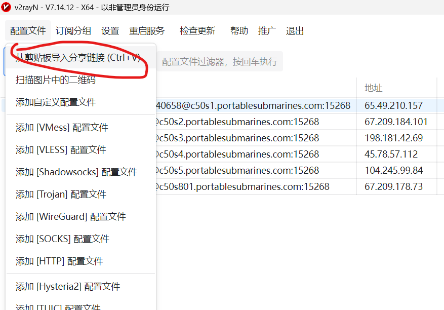
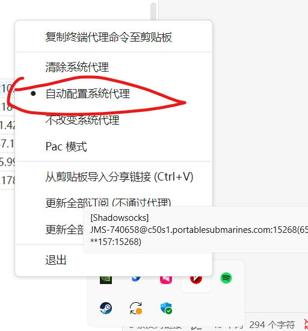

# 1. 下载安装

nas的`gongxiang/AI项目组/刘佳璇/v2rayN-windows-64.zip`

双击v2rayN.exe运行

# 2. 配置使用

`https://jjsubmarines.com/members/getsub.php?service=740658&id=aafa67f8-b6fa-449e-8096-1692bea5864d`

1. 

2. 

3. 

