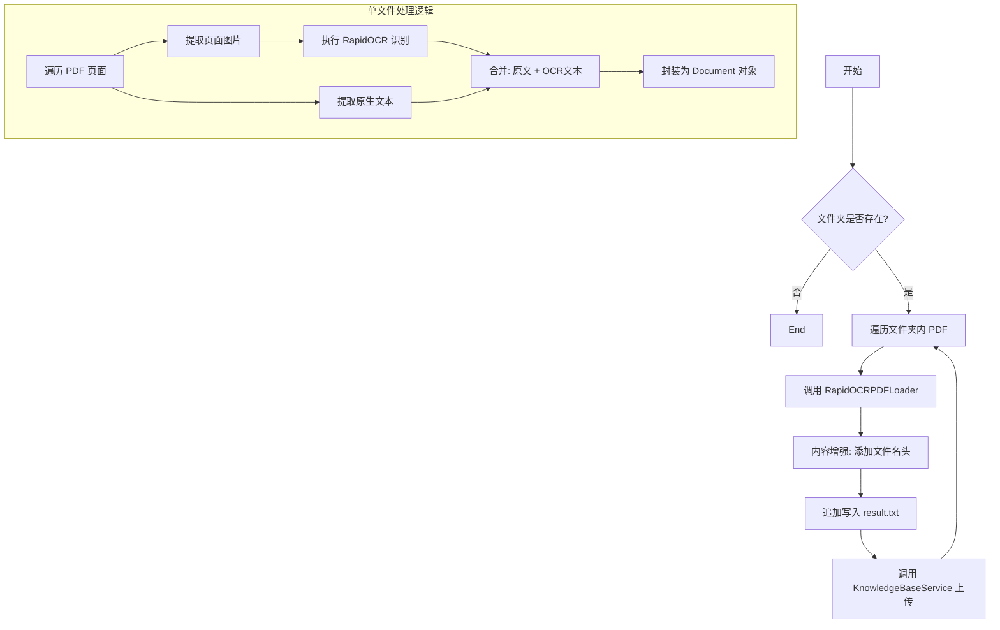

# 1. 处理知识库并将其上传到向量数据库中

这份文档详细说明了提供的 Python 脚本的逻辑。该脚本的主要功能是：**批量读取本地 PDF 文件，利用 OCR 技术提取文本（包括图片中的文字），对文本进行上下文增强，并最终将其上传至向量数据库（知识库）。**

---
## 1. 功能概述

该脚本旨在解决传统 PDF 加载器无法处理**扫描件**或**纯图片 PDF** 的问题。它采用“混合提取模式”，同时抓取可编辑文本和图片中的文本，确保数据完整性。处理后的数据会被赋予文件名作为上下文，并推送到后续的 `KnowledgeBaseService` 进行向量化存储。

## 2. 核心依赖

- **RapidOCR (`rapidocr_onnxruntime`)**: 用于对 PDF 中的图片进行文字识别。
    
- **PyMuPDF (`fitz`)**: 高性能 PDF 处理库，用于提取页面文本和图片二进制数据。
    
- **LangChain (`Document`)**: 标准化文档对象封装。
    

---

## 3. 逻辑流程详解

整个脚本的执行流程可以分为两个主要部分：**单文件加载逻辑** (`RapidOCRPDFLoader`) 和 **批量处理与入库逻辑** (`load_and_enhance_documents`)。

### 3.1 核心组件：`RapidOCRPDFLoader` 类

这是一个自定义的文档加载器，其核心逻辑在于“**查漏补缺**”。

- **步骤 1：初始化**
    
    - 实例化 `RapidOCR` 引擎，准备进行图像识别。
        
- **步骤 2：逐页扫描**
    
    - 使用 `fitz` 打开 PDF，遍历每一页。
        
- **步骤 3：双重提取（Hybrid Extraction）**
    
    - **文本提取**：首先尝试使用 `page.get_text()` 提取页面原本的文字（针对电子版 PDF）。
        
    - **图片提取与 OCR**：
        
        1. 扫描页面中的所有图片对象。
            
        2. 提取图片的二进制数据。
            
        3. 调用 `self.ocr` 进行文字识别。
            
        4. 将识别结果拼接成字符串。
            
- **步骤 4：内容合并**
    
    - 将“原有文本”和“OCR 识别文本”拼接在一起 (`text + "\n" + ocr_text`)。
        
    - _逻辑意义_：这样既能保证电子版 PDF 的准确性，又能覆盖 PDF 中嵌入的截图、表格图片或扫描页面的内容。
        
- **步骤 5：封装 Document**
    
    - 将合并后的文本封装为 LangChain 的 `Document` 对象。
        
    - 记录元数据 (`metadata`)，包含：文件路径、页码、文件名。
        

### 3.2 业务流程：`load_and_enhance_documents` 函数

这是脚本的主入口函数，负责文件管理、数据增强和持久化。

- **步骤 1：环境检查**
    
    - 检查配置的 `folder_path` 是否存在。
        
- **步骤 2：遍历文件**
    
    - 扫描文件夹下所有 `.pdf` 结尾的文件。
        
- **步骤 3：调用加载器**
    
    - 传入文件路径，获取 `RapidOCRPDFLoader` 返回的 `List[Document]`（即每一页是一个 Document）。
        
- **步骤 4：上下文增强 (Context Enhancement)**
    
    - 提取纯文件名（不含后缀）。
        
    - **关键操作**：在每页内容的开头强制加上 `【来源文件: filename】`。
        
    - _逻辑意义_：当这段文本被切片并存入向量库后，Retrieve（检索）阶段 AI 能够知道这段话出自哪本书或哪份合同，防止上下文缺失。
        
- **步骤 5：本地备份 (Logging)**
    
    - 将识别出的内容追加写入到本地的 `result.txt` 文件中，用于人工核查识别效果。
        
- **步骤 6：上传向量库**
    
    - 调用 `KnowledgeBaseService().upload_by_str(...)`。
        
    - 将处理好的文本字符串直接发送给后端服务进行 Embedding（向量化）和存储。
        

---

## 4. 数据流向图 (Workflow)

代码段

---

## 5. 代码中的关键细节说明

1. **异常处理**:
    
    - 脚本开头包含了对 `rapidocr_onnxruntime` 的导入检查，如果未安装会直接提示并退出，避免运行时错误。
        
    - 文件遍历循环中包含了 `try...except`，确保某一个 PDF 损坏不会导致整个批处理任务中断。
        
2. **OCR 策略**:
    
    - 代码采用了 `img_list = page.get_images(full=True)`。这意味着它不仅仅是对页面截图，而是提取页面内嵌入的每一个图片对象。这对于处理图文混排的 PDF 非常有效。
        
3. **结果返回**:
    
    - 注意代码中 `# documents.extend(docs)` 被注释掉了。
        
    - 这意味着 `load_and_enhance_documents` 函数实际上返回的是空列表 `[]`。
        
    - **结论**：该函数被设计为“副作用函数”（Side Effect），即它的主要目的不是返回数据，而是执行操作（写入文件、上传数据库）。
        
4. **文件写入模式**:
    
    - 使用 `with open("result.txt", "a", ...)` 追加模式。这保证了在循环处理大量文件时，前面的识别结果不会被覆盖。
        

## 6. 总结

这段代码是一个健壮的 **ETL（Extract, Transform, Load）脚本**：

- **Extract (提取)**: 使用 PyMuPDF 和 RapidOCR 从 PDF 中提取多模态文字信息。
    
- **Transform (转换)**: 增加文件名作为语义上下文，清洗格式。
    
- **Load (加载)**: 将清洗后的数据加载到向量知识库服务中。