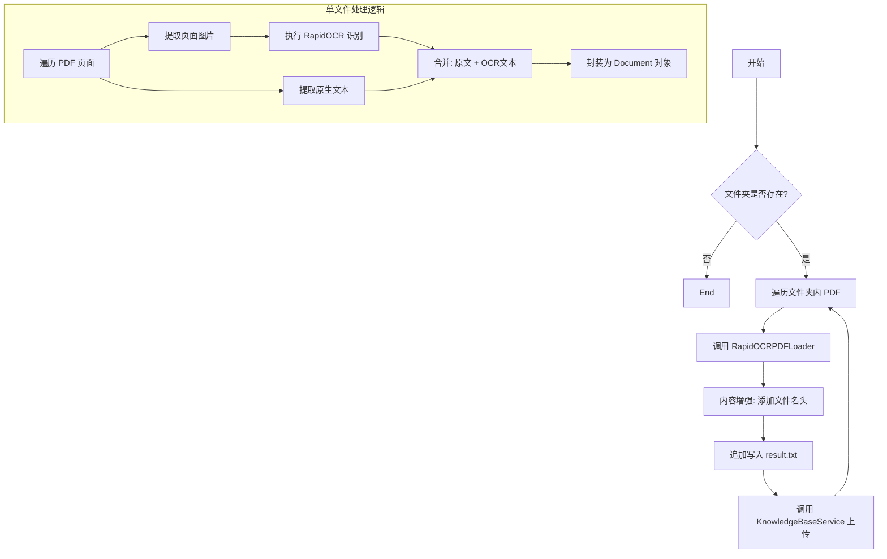

# 1. 处理知识库并将其上传到向量数据库中

这份文档详细说明了提供的 Python 脚本的逻辑。该脚本的主要功能是：**批量读取本地 PDF 文件，利用 OCR 技术提取文本（包括图片中的文字），对文本进行上下文增强，并最终将其上传至向量数据库（知识库）。**

---
## 1. 功能概述

该脚本旨在解决传统 PDF 加载器无法处理**扫描件**或**纯图片 PDF** 的问题。它采用“混合提取模式”，同时抓取可编辑文本和图片中的文本，确保数据完整性。处理后的数据会被赋予文件名作为上下文，并推送到后续的 `KnowledgeBaseService` 进行向量化存储。

## 2. 核心依赖

- **RapidOCR (`rapidocr_onnxruntime`)**: 用于对 PDF 中的图片进行文字识别。
    
- **PyMuPDF (`fitz`)**: 高性能 PDF 处理库，用于提取页面文本和图片二进制数据。
    
- **LangChain (`Document`)**: 标准化文档对象封装。
    

---

## 3. 逻辑流程详解

整个脚本的执行流程可以分为两个主要部分：**单文件加载逻辑** (`RapidOCRPDFLoader`) 和 **批量处理与入库逻辑** (`load_and_enhance_documents`)。

### 3.1 核心组件：`RapidOCRPDFLoader` 类

这是一个自定义的文档加载器，其核心逻辑在于“**查漏补缺**”。

- **步骤 1：初始化**
    
    - 实例化 `RapidOCR` 引擎，准备进行图像识别。
        
- **步骤 2：逐页扫描**
    
    - 使用 `fitz` 打开 PDF，遍历每一页。
        
- **步骤 3：双重提取（Hybrid Extraction）**
    
    - **文本提取**：首先尝试使用 `page.get_text()` 提取页面原本的文字（针对电子版 PDF）。
        
    - **图片提取与 OCR**：
        
        1. 扫描页面中的所有图片对象。
            
        2. 提取图片的二进制数据。
            
        3. 调用 `self.ocr` 进行文字识别。
            
        4. 将识别结果拼接成字符串。
            
- **步骤 4：内容合并**
    
    - 将“原有文本”和“OCR 识别文本”拼接在一起 (`text + "\n" + ocr_text`)。
        
    - _逻辑意义_：这样既能保证电子版 PDF 的准确性，又能覆盖 PDF 中嵌入的截图、表格图片或扫描页面的内容。
        
- **步骤 5：封装 Document**
    
    - 将合并后的文本封装为 LangChain 的 `Document` 对象。
        
    - 记录元数据 (`metadata`)，包含：文件路径、页码、文件名。
        

### 3.2 业务流程：`load_and_enhance_documents` 函数

这是脚本的主入口函数，负责文件管理、数据增强和持久化。

- **步骤 1：环境检查**
    
    - 检查配置的 `folder_path` 是否存在。
        
- **步骤 2：遍历文件**
    
    - 扫描文件夹下所有 `.pdf` 结尾的文件。
        
- **步骤 3：调用加载器**
    
    - 传入文件路径，获取 `RapidOCRPDFLoader` 返回的 `List[Document]`（即每一页是一个 Document）。
        
- **步骤 4：上下文增强 (Context Enhancement)**
    
    - 提取纯文件名（不含后缀）。
        
    - **关键操作**：在每页内容的开头强制加上 `【来源文件: filename】`。
        
    - _逻辑意义_：当这段文本被切片并存入向量库后，Retrieve（检索）阶段 AI 能够知道这段话出自哪本书或哪份合同，防止上下文缺失。
        
- **步骤 5：本地备份 (Logging)**
    
    - 将识别出的内容追加写入到本地的 `result.txt` 文件中，用于人工核查识别效果。
        
- **步骤 6：上传向量库**
    
    - 调用 `KnowledgeBaseService().upload_by_str(...)`。
        
    - 将处理好的文本字符串直接发送给后端服务进行 Embedding（向量化）和存储。
        

---

## 4. 数据流向图 (Workflow)

代码段




---

## 5. 代码中的关键细节说明

1. **异常处理**:
    
    - 脚本开头包含了对 `rapidocr_onnxruntime` 的导入检查，如果未安装会直接提示并退出，避免运行时错误。
        
    - 文件遍历循环中包含了 `try...except`，确保某一个 PDF 损坏不会导致整个批处理任务中断。
        
2. **OCR 策略**:
    
    - 代码采用了 `img_list = page.get_images(full=True)`。这意味着它不仅仅是对页面截图，而是提取页面内嵌入的每一个图片对象。这对于处理图文混排的 PDF 非常有效。
        
3. **结果返回**:
    
    - 注意代码中 `# documents.extend(docs)` 被注释掉了。
        
    - 这意味着 `load_and_enhance_documents` 函数实际上返回的是空列表 `[]`。
        
    - **结论**：该函数被设计为“副作用函数”（Side Effect），即它的主要目的不是返回数据，而是执行操作（写入文件、上传数据库）。
        
4. **文件写入模式**:
    
    - 使用 `with open("result.txt", "a", ...)` 追加模式。这保证了在循环处理大量文件时，前面的识别结果不会被覆盖。
        

## 6. 总结

这段代码是一个健壮的 **ETL（Extract, Transform, Load）脚本**：

- **Extract (提取)**: 使用 PyMuPDF 和 RapidOCR 从 PDF 中提取多模态文字信息。
    
- **Transform (转换)**: 增加文件名作为语义上下文，清洗格式。
    
- **Load (加载)**: 将清洗后的数据加载到向量知识库服务中。


# 2. 向量知识库服务模块

这份文档详细说明了 `knowledge_base.py` 模块的逻辑。该模块主要实现了一个**基于 ChromaDB 和 Ollama 的本地向量知识库服务**，具备内容去重、文本切分和向量持久化存储的功能。

---

## 1. 模块概述

该模块封装了 `KnowledgeBaseService` 类，用于管理本地知识库的核心操作。其主要职责是将纯文本数据（String）经过清洗、去重、切分后，通过 Embedding 模型转化为向量，并存储在 Chroma 向量数据库中。

## 2. 核心功能特性

- **内容去重 (MD5 Deduplication)**: 通过计算文本内容的 MD5 哈希值，防止相同的内容重复存入数据库。
    
- **智能切分 (Smart Splitting)**: 使用递归字符切分器 (`RecursiveCharacterTextSplitter`) 将长文本切分为适合模型处理的片段。
    
- **向量化存储 (Vector Storage)**: 集成 `Chroma` 数据库和 `OllamaEmbeddings`，实现文本到向量的转换与持久化。
    
- **元数据管理 (Metadata)**: 为存储的每一段文本自动附加来源、创建时间和操作人信息。
    

---

## 3. 详细逻辑流程

### 3.1 辅助函数：MD5 去重机制

为了避免重复处理相同的文本，模块利用本地文件 (`config.md5_path`) 记录已处理内容的指纹。

1. **`get_string_md5(input_str)`**:
    
    - 接收输入字符串，编码为 utf-8 字节流。
        
    - 利用 `hashlib.md5` 计算出 32 位十六进制的 MD5 字符串。
        
2. **`check_md5(md5_str)`**:
    
    - 检查记录文件是否存在。如果不存则创建并返回 `False`（未处理）。
        
    - 如果存在，逐行读取文件内容，比对传入的 MD5 值。
        
    - **逻辑**: 如果在文件中找到了该 MD5，说明该内容之前已经入库过，返回 `True`；否则返回 `False`。
        
3. **`save_md5(md5_str)`**:
    
    - 将新的 MD5 值追加写入到记录文件的末尾，作为已处理的标记。
        

### 3.2 核心类：`KnowledgeBaseService`

#### 初始化 (`__init__`)

在实例化服务时，执行以下配置：

1. **目录检查**: 确保向量库的持久化存储目录 (`config.persist_directory`) 存在。
    
2. **向量库实例 (`self.chroma`)**:
    
    - 初始化 Chroma 客户端。
        
    - 指定 Embedding 模型为 `OllamaEmbeddings` (模型名称来自 config)。
        
    - 设置持久化目录，确保数据重启不丢失。
        
3. **文本切分器 (`self.spliter`)**:
    
    - 初始化 `RecursiveCharacterTextSplitter`。
        
    - 配置 `chunk_size` (块大小) 和 `chunk_overlap` (重叠长度) 以保持语义连贯性。
        

#### 上传与入库 (`upload_by_str`)

这是该模块最核心的业务函数，接收文本数据和文件名。

**执行步骤：**

1. **计算指纹**: 调用 `get_string_md5` 计算当前文本的 MD5。
    
2. **去重校验**:
    
    - 调用 `check_md5`。
        
    - 如果返回 `True`，直接返回提示 `"[跳过]内容已经存在知识库中"`，**终止流程**。
        
3. **文本处理**:
    
    - 判断文本长度是否超过阈值 (`config.max_split_char_number`)。
        
    - **超过阈值**: 调用切分器 `self.spliter.split_text` 将长文本切分为多个片段 (`knowledge_chunks`)。
        
    - **未超阈值**: 将原文本直接作为唯一的片段。
        
4. **构建元数据**:
    
    - 为每个片段准备 Metadata 字典，包含：
        
        - `source`: 文件名。
            
        - `create_time`: 当前系统时间。
            
        - `operator`: 操作员（代码中固定为 "刘"）。
            
5. **向量化与存储**:
    
    - 调用 `self.chroma.add_texts`。
        
    - Chroma 内部会自动调用 Ollama 模型将 `knowledge_chunks` 转换为向量。
        
    - 将向量、文本内容和元数据一起存入本地数据库。
        
6. **记录指纹**:
    
    - 入库成功后，调用 `save_md5` 将当前文本的 MD5 写入记录文件。
        
7. **返回结果**: 返回成功提示信息。
    

---

## 4. 逻辑流程图 (Workflow)

代码段

```
graph TD
    Start[调用 upload_by_str] --> CalcMD5[计算文本 MD5]
    CalcMD5 --> CheckMD5{check_md5: 是否已存在?}
    
    CheckMD5 -- 是 (True) --> Skip[返回: 跳过，内容已存在]
    
    CheckMD5 -- 否 (False) --> CheckLen{文本长度 > max_split?}
    
    CheckLen -- 是 --> Split[使用 Spliter 切分文本]
    CheckLen -- 否 --> NoSplit[保持原文本]
    
    Split --> MakeMeta[构建 Metadata (时间/来源)]
    NoSplit --> MakeMeta
    
    MakeMeta --> Embed[调用 Chroma & Ollama 进行向量化]
    Embed --> SaveDB[存入向量数据库]
    
    SaveDB --> RecordMD5[调用 save_md5 记录指纹]
    RecordMD5 --> Success[返回: 成功载入]
```


---

## 5. 数据结构说明

### 5.1 存储在 Chroma 中的数据形态

对于每一条入库的知识，Chroma 会存储以下结构：

|**字段**|**说明**|**示例**|
|---|---|---|
|**Document**|切分后的实际文本内容|"周杰轮222"|
|**Embedding**|文本对应的向量数据|`[-0.012, 0.821, ...]` (由 Ollama 生成)|
|**Metadata**|辅助信息字典|`{'source': 'testfile', 'create_time': '2025-01-26...', 'operator': '刘'}`|
|**ID**|唯一标识符|UUID (自动生成)|

### 5.2 依赖配置 (`config_data`)

代码严重依赖 `config_data` 模块，预期该配置包含以下关键变量：

- `md5_path`: MD5 记录文件的路径。
    
- `persist_directory`: Chroma 数据库的存储路径。
    
- `collection_name`: 向量库集合名称。
    
- `EMBED_MODEL`: 使用的 Embedding 模型名称 (如 `nomic-embed-text` 或 `qwen`).
    
- `chunk_size` / `chunk_overlap`: 切分参数。
    
- `max_split_char_number`: 触发切分的长度阈值。

# 3. 向量检索服务模块文档

这份文档详细说明了 `VectorStoreService` 类的逻辑。该模块的主要作用是**封装 Chroma 向量数据库的读取操作**，并将静态的数据库对象转换为可用于 LangChain 流程（Chain）的动态检索器（Retriever）。

---

## 1. 模块概述

该模块封装了一个名为 `VectorStoreService` 的服务类。它的核心职责并非“写入”数据，而是**加载**已有的本地向量数据，并提供一个标准化的接口（Retriever）供上层应用进行语义搜索。

它是 RAG（检索增强生成）系统中的**检索（Retrieval）** 环节的核心组件。

## 2. 核心类：`VectorStoreService`

### 2.1 初始化逻辑 (`__init__`)

构造函数负责建立与本地 Chroma 数据库的连接。

- **输入参数**: `embedding` (嵌入模型实例)
    
    - 必须传入与构建知识库时**完全一致**的 Embedding 模型对象（例如 DashScope, Ollama 等）。如果不一致，会导致检索出的向量空间不匹配，无法搜到正确结果。
        
- **核心操作**:
    
    - 实例化 `langchain_chroma.Chroma` 对象。
        
    - **`persist_directory`**: 指定从哪里读取数据（必须与之前入库时的路径一致）。
        
    - **`collection_name`**: 指定读取哪一张“表”（集合）。
        

### 2.2 获取检索器 (`get_retriever`)

此方法将向量库对象转换为检索器对象，这是 LangChain LCEL 调用的关键步骤。

- **返回值**: `VectorStoreRetriever` 对象。
    
- **搜索参数配置 (`search_kwargs`)**:
    
    - 代码中使用 `{"k": config.similarity_threshold}` 来配置检索行为。
        
    - **关键逻辑说明**: 这里的参数 `k` 代表 **"Top K"**，即每次检索返回最相似的文档数量。
        
    - _注意：配置变量名为 `similarity_threshold`（通常暗示相似度阈值），但在代码中被赋值给了 `k`（返回数量）。这意味着该配置项实际上是在控制返回几条数据（例如 3 或 4 条）。_
        

---

## 3. 逻辑流程图 (Workflow)

代码段

```
graph TD
    subgraph Init [初始化阶段]
        Config[读取 config_data] --> Path(获取持久化路径 persist_directory)
        Embedding[传入 Embedding 模型] --> ChromaObj[初始化 Chroma 对象]
        Path --> ChromaObj
    end

    subgraph Runtime [运行时: get_retriever]
        ChromaObj --> AsRetriever[调用 .as_retriever()]
        ConfigK[读取 config.similarity_threshold] --> SetK{设置参数 k}
        SetK --> AsRetriever
        AsRetriever --> RetrieverObj[返回 Retriever 对象]
    end

    subgraph UserCall [调用示例]
        Query["用户提问: 体重180斤..."] --> RetrieverObj
        RetrieverObj --> VectorSearch[向量相似度搜索]
        VectorSearch --> Result[返回 Top K 个 Document]
    end
```

---

## 4. `if __name__ == '__main__':` 测试逻辑

代码底部的测试模块展示了该服务的实际调用方式：

1. **模型准备**: 引入 `DashScopeEmbeddings` 并使用 `text-embedding-v4` 模型（这是阿里云通义千问的嵌入模型）。
    
2. **服务实例化**:
    
    - `VectorStoreService(...)`: 传入嵌入模型，连接本地数据库。
        
    - `.get_retriever()`: 立即获取检索器接口。
        
3. **模拟检索**:
    
    - 调用 `retriever.invoke("我的体重180斤，尺码推荐")`。
        
    - 系统会将这句话转化为向量，在数据库中查找最相似的 `k` 条记录（比如衣服尺码对照表），并打印结果。
        

---

## 5. 依赖配置说明 (`config_data`)

该代码强依赖 `config_data` 模块中的以下变量，使用前需确保配置正确：

|**配置项**|**作用**|**逻辑影响**|
|---|---|---|
|`collection_name`|集合名称|类似于 SQL 中的表名，读写必须一致。|
|`persist_directory`|持久化目录|数据库文件在硬盘上的存储文件夹路径。|
|`similarity_threshold`|**返回数量 (Top K)**|决定检索器一次返回几条参考文档（注意代码中将其赋给了 `k`）。|

## 6. 总结

这段代码实现了 **"搜索接口"** 的功能。如果把之前的入库脚本比作“把书放进图书馆”，那么这段代码就是“图书管理员”。它不关心书是怎么来的，只负责根据用户的描述（Embedding），从指定的书架（Collection）上，拿出最相关的几本书（Top K Documents）。


# 4. 本地文件聊天记录存储模块文档


这份文档详细说明了您提供的 Python 代码逻辑。该模块实现了一个**基于本地文件的持久化聊天记录存储器**，它遵循 LangChain 的标准接口设计，用于让 AI 记住之前的对话内容。

---

## 1. 模块概述

该模块定义了一个自定义的聊天记录管理类 `FileChatMessageHistory`，它继承自 LangChain 的 `BaseChatMessageHistory`。

**核心功能**：

- **持久化**：将内存中的聊天记录保存到本地硬盘的 JSON 文件中。
    
- **会话隔离**：通过 `session_id` 区分不同用户的对话，每个用户对应一个独立的文件。
    
- **序列化与反序列化**：自动在 LangChain 的 `Message` 对象（如 `HumanMessage`, `AIMessage`）和 JSON 数据之间转换。
    

## 2. 核心组件详解

### 2.1 辅助工厂函数：`get_history`

Python

```
def get_history(session_id):
    return FileChatMessageHistory(session_id, "./chat_history")
```

- **作用**：这是一个**工厂函数**。
    
- **使用场景**：在使用 LangChain 的 `RunnableWithMessageHistory` 时，需要传入一个回调函数来获取历史记录。这个函数就是用来告诉 LangChain：“去 `./chat_history` 文件夹里找对应 `session_id` 的记录”。
    

### 2.2 核心类：`FileChatMessageHistory`

该类负责具体的读写逻辑，主要包含以下四个部分：

#### A. 初始化 (`__init__`)

- **输入**：`session_id` (会话ID), `storage_path` (存储目录)。
    
- **逻辑**：
    
    1. 拼接完整的文件路径。例如：`./chat_history/user_123`。
        
    2. 调用 `os.makedirs` 确保父目录存在。如果目录不存在，会自动创建，防止写入时报错。
        

#### B. 写入消息 (`add_messages`)

每当产生新对话（用户提问或 AI 回答）时，LangChain 会自动调用此方法。

- **流程**：
    
    1. **读取旧数据**：`list(self.messages)` 获取当前文件里已有的消息。
        
    2. **合并**：`extend(messages)` 将新消息追加到旧消息列表中。
        
    3. **序列化 (关键)**：
        
        - 由于 `HumanMessage` 等对象是 Python 类实例，无法直接存入 JSON。
            
        - 代码使用 `message_to_dict` 将对象转为字典（例如 `{'type': 'human', 'content': '你好'}`）。
            
    4. **写入文件**：使用 `json.dump` 以覆盖模式 (`w`) 将完整的列表写入文件。
        

#### C. 读取消息 (`messages` 属性)

这是一个被 `@property` 装饰的方法，外部调用 `history.messages` 时会自动触发。

- **流程**：
    
    1. 尝试以只读模式 (`r`) 打开文件。
        
    2. **反序列化 (关键)**：
        
        - 使用 `json.load` 读取出列表字典。
            
        - 使用 `messages_from_dict` 将字典还原回 LangChain 的 `Message` 对象。
            
    3. **异常处理**：如果文件不存在 (`FileNotFoundError`)，说明是新会话，返回空列表 `[]`。
        

#### D. 清空记录 (`clear`)

- **逻辑**：直接以写入模式打开文件并写入一个空列表 `[]`，从而清空该会话的所有记忆。
    

---

## 3. 数据流向图 (Workflow)

代码段

```
graph LR
    subgraph Memory Process
    User[用户输入/AI输出] --> Obj[Message 对象]
    Obj -->|add_messages| Serialize[序列化: message_to_dict]
    Serialize --> Dict[Python 字典]
    Dict -->|json.dump| File[(本地 JSON 文件)]
    
    File -->|json.load| DictList[字典列表]
    DictList -->|messages 属性| Deserialize[反序列化: messages_from_dict]
    Deserialize --> Restore[还原 Message 对象]
    Restore --> Chain[LangChain 上下文]
    end
```

---

## 4. 如何在项目中使用

这个类通常配合 LangChain 的 `RunnableWithMessageHistory` 一起使用。

### 示例代码

Python

```
from langchain_core.runnables.history import RunnableWithMessageHistory
from langchain_ollama import ChatOllama
from langchain_core.prompts import ChatPromptTemplate, MessagesPlaceholder

# 1. 导入你写的这个模块
# from your_module import get_history 

# 2. 定义简单的链
model = ChatOllama(model="qwen2.5")
prompt = ChatPromptTemplate.from_messages([
    ("system", "你是一个助手"),
    MessagesPlaceholder(variable_name="history"), # 占位符，用于填充历史记录
    ("human", "{input}"),
])
chain = prompt | model

# 3. 包装链，赋予其记忆能力
chain_with_history = RunnableWithMessageHistory(
    chain,
    get_session_history=get_history,  # <--- 这里传入你的工厂函数
    input_messages_key="input",
    history_messages_key="history",
)

# 4. 调用（指定 session_id）
# 第一次对话：会创建 ./chat_history/user_1 文件
response1 = chain_with_history.invoke(
    {"input": "我是小明"},
    config={"configurable": {"session_id": "user_1"}}
)
print(response1.content) 

# 第二次对话：会自动读取 ./chat_history/user_1 中的内容
response2 = chain_with_history.invoke(
    {"input": "我叫什么名字？"},
    config={"configurable": {"session_id": "user_1"}}
)
print(response2.content) # AI 应该能回答 "你是小明"
```

## 5. 优缺点分析

- **优点**：
    
    - **实现简单**：无需安装 Redis、Postgres 等数据库，利用本地文件系统即可运行。
        
    - **可移植性强**：代码拷贝到任何支持 Python 的环境都能跑。
        
    - **易于调试**：存储的是 JSON 文本文件，可以直接打开查看历史记录内容。
        
- **缺点**：
    
    - **性能瓶颈**：每次写入都是“全量重写”（Read-Modify-Write），如果对话历史非常长（例如几万字），读写文件会变慢。
        
    - **并发问题**：如果多个线程同时操作同一个 `session_id` 的文件，可能会导致数据覆盖或损坏（即非线程安全）。但在个人使用的本地应用中通常不是问题。

# 5. Rag系统逻辑

这份文档详细说明了 `rag_service.py` 模块的逻辑。该模块实现了一个**带有对话记忆功能的 RAG（检索增强生成）服务**，它将向量检索、历史记录管理和 LLM 推理通过 LangChain LCEL 组装成一条完整的执行链。

---

## 1. 模块概述

`RagService` 类是整个智能问答系统的“大脑”。它集成了以下核心能力：

- **知识检索**: 调用 `VectorStoreService` 从本地向量库中查找相关资料。
    
- **对话记忆**: 通过 `file_history_store` 自动管理用户的历史对话记录。
    
- **流程编排**: 使用 LangChain LCEL (LangChain Expression Language) 定义数据的流转逻辑。
    

## 2. 核心类：`RagService`

### 2.1 初始化 (`__init__`)

初始化阶段主要完成组件的装配：

1. **向量服务**: 实例化 `VectorStoreService`，使用 Ollama 的 Embedding 模型。
    
2. **LLM 模型**: 初始化 `ChatOllama`，设置 `temperature=0` 以保证回答的严谨性。
    
3. **Prompt 模板**: 定义了包含三个部分的提示词：
    
    - **System**: 强调基于 `{context}` (参考资料) 回答。
        
    - **History**: 使用 `MessagesPlaceholder("history")` 占位符，LangChain 会自动在此填入历史对话。
        
    - **User**: 用户的实际提问 `{input}`。
        

### 2.2 核心执行链 (`__get_chain`)

这是代码中最复杂的部分，使用了 LCEL 将各个环节串联起来。

#### A. 辅助函数 (Lambda)

为了适配数据格式，定义了三个内部函数：

1. **`format_document(docs)`**:
    
    - **输入**: 检索到的 `Document` 对象列表。
        
    - **输出**: 拼接后的字符串。
        
    - **逻辑**: 将每个文档的内容 (`page_content`) 和元数据 (`metadata`) 格式化为易读的文本块。
        
2. **`format_for_retriever(value)`**:
    
    - **作用**: 从上游传入的字典中提取用户的问题字符串，传给检索器。
        
    - **逻辑**: 返回 `value["input"]`。
        
3. **`format_for_prompt_template(value)`**:
    
    - **作用**: **数据清洗与重组**。这是连接“检索阶段”和“Prompt填充阶段”的桥梁。
        
    - **原因**: 由于使用了 `RunnableParallel`（即那个字典结构 `{...}`），数据被嵌套了一层。
        
    - **逻辑**:
        
        - 用户问题来自 `value["input"]["input"]`。
            
        - 历史记录来自 `value["input"]["history"]`。
            
        - 参考资料来自 `value["context"]`。
            
        - 最终返回一个扁平的字典，供 `prompt_template` 使用。
            

#### B. LCEL 链结构详解

该链条由**内部逻辑链**和**外部记忆包装器**组成。

**1. 内部逻辑链 (`chain`)**:

Python

```
chain = (
    # 第一步：并行处理 (RunnableParallel)
    # 输入数据结构示例: {'input': '你好', 'history': [HumanMessage(...), AIMessage(...)]}
    {
        # 1.1 透传原始输入 (包含 input 和 history)
        "input": RunnablePassthrough(), 
        
        # 1.2 检索分支: 提取问题 -> 检索 -> 格式化文档
        "context": RunnableLambda(format_for_retriever) | retriever | format_document
    } 
    # 第二步：数据重组 (解包嵌套字典)
    | RunnableLambda(format_for_prompt_template) 
    # 第三步：填充 Prompt -> 打印调试 -> LLM -> 解析字符串
    | self.prompt_template | print_prompt | self.chat_model | StrOutputParser()
)
```

**2. 外部记忆包装 (`conversation_chain`)**:

使用 `RunnableWithMessageHistory` 包裹上述链条。

- **作用**: 自动根据 `session_id` 读取历史记录，注入到输入字典的 `history` 键中；并在执行结束后，自动保存新的对话到文件。
    

---

## 3. 数据流向图 (Data Flow)

下面的流程图展示了一次调用中，数据是如何在各个组件间流转的：

代码段

```
graph TD
    UserStart[用户调用 chain.invoke] -->|{"input": "问题", session_id: "001"}| HistoryWrapper[RunnableWithMessageHistory]
    
    subgraph HistoryWrapper Logic
        HistoryWrapper -->|读取文件| LoadHistory[加载历史记录]
        LoadHistory -->|注入 history| InputDict[输入字典: {input: "问题", history: [...]}]
    end
    
    InputDict --> ParallelStep{RunnableParallel 并行处理}
    
    subgraph Context Branch [检索分支]
        ParallelStep -->|提取 input| Retriever[检索器]
        Retriever -->|返回 Docs| FormatDocs[format_document]
        FormatDocs -->|生成字符串| ContextStr["文档片段: ..."]
    end
    
    subgraph Passthrough Branch [透传分支]
        ParallelStep -->|保持原样| RawInput[输入字典: {input:..., history:...}]
    end
    
    ContextStr & RawInput --> Merge[合并结果]
    Merge -->|数据结构: {context: "...", input: {input: "...", history: ...}}| Reformat[format_for_prompt_template]
    
    Reformat -->|扁平化字典: {input, context, history}| Prompt[填充 PromptTemplate]
    Prompt --> LLM[ChatOllama 推理]
    LLM --> Output[StrOutputParser]
    
    Output --> HistoryWrapper
    HistoryWrapper -->|保存 input 和 output| SaveHistory[写入历史文件]
    SaveHistory --> FinalResult[返回给用户]
```

---

## 4. 调用示例说明

在 `if __name__ == '__main__':` 中：

Python

```
session_config = {
    "configurable": {
        "session_id": "user_001", # 指定会话ID
    }
}
# 调用时只需传入 input，history 由包装器自动处理
res = RagService().chain.invoke(
    {"input": "使命召唤19现代战争2游戏卡顿如何解决？"}, 
    session_config
)
```

1. **会话隔离**: 修改 `session_id` 即可切换不同用户的记忆空间。
    
2. **执行结果**:
    
    - 控制台会先打印出完整的 Prompt（包含系统指令、历史记录、检索到的文档）。
        
    - 最后打印出 AI 的回答。
        

## 5. 关键设计点总结

1. **解耦**: 向量检索逻辑被封装在 `VectorStoreService` 中，记忆存储逻辑被封装在 `file_history_store` 中，`RagService` 只负责组装。
    
2. **数据清洗**: 使用 `RunnableLambda` 解决了 LangChain 并行链产生的数据嵌套问题，确保 Prompt 模板能接收到正确的参数。
    
3. **调试友好**: 加入了 `print_prompt` 环节，可以在控制台直观地看到发给 LLM 的最终提示词，方便排查 Prompt 注入问题。


---

# 6. RAG 智能问答系统 API 服务文档 (`main.py`)

## 1. 系统概述

该模块充当 **API 网关** 的角色。它不负责具体的 AI 推理逻辑（这部分由 `RagService` 完成），而是负责处理 HTTP 请求、参数校验、跨域资源共享 (CORS) 以及响应数据的格式化（包括流式和非流式）。

## 2. 核心架构与逻辑

### 2.1 全局服务初始化

代码采用了 **单例模式 (Singleton)** 的思想来初始化 `RagService`。

Python

```
try:
    rag_service = RagService() # 全局变量
    print("✅ RAG Service 初始化成功")
except Exception as e:
    ...
```

- **逻辑**：在服务启动时（`if __name__ == "__main__"` 或 uvicorn 启动时）立即加载模型和向量库。
    
- **目的**：避免每次用户请求时都重新加载庞大的 Embedding 模型和 LLM，从而显著降低接口响应延迟。
    

### 2.2 跨域配置 (CORS)

Python

```
app.add_middleware(CORSMiddleware, allow_origins=["*"], ...)
```

- **作用**：允许浏览器中的前端页面（例如运行在 `localhost:8080` 的 Vue 应用）跨域调用本服务（运行在 `localhost:8000`）。没有这个配置，浏览器会拦截请求。
    

---

## 3. 数据模型 (Input Schema)

使用 Pydantic 定义了请求体，确保输入数据类型安全。

|**字段名**|**类型**|**必填**|**说明**|**示例**|
|---|---|---|---|---|
|**`question`**|`str`|是|用户的问题文本|"显卡驱动怎么更新？"|
|**`session_id`**|`str`|否|会话唯一标识，默认为 `user_default`|"user_10086"|

---

## 4. API 接口详解

该服务提供了两个核心接口，分别对应两种不同的交互体验。

### 4.1 普通对话接口 (`/chat`)

- **URL**: `/chat`
    
- **Method**: `POST`
    
- **类型**: 同步阻塞 (Synchronous/Blocking)
    
- **逻辑**:
    
    1. 接收 JSON 请求。
        
    2. 调用 `rag_service.chain.invoke()`。此时服务器线程会**等待** LLM 生成完整的答案。
        
    3. LLM 生成完毕后，将完整结果封装为 JSON 返回。
        
- **适用场景**: 内部测试、不需要打字机效果的简单 UI、后台批量处理。
    

### 4.2 流式对话接口 (`/chat/stream`)

- **URL**: `/chat/stream`
    
- **Method**: `POST`
    
- **类型**: 异步流式 (Asynchronous Streaming)
    
- **协议**: **SSE (Server-Sent Events)**
    
- **逻辑**:
    
    1. 接收请求后，立即建立长连接。
        
    2. 利用 `async def` 定义生成器。
        
    3. 通过 `rag_service.chain.stream()` 获取 LLM 生成的每一个字符片段 (Token)。
        
    4. **格式化**: 将片段封装为 SSE 标准格式：`data: {"answer": "字"}\n\n`。
        
    5. **结束**: 发送 `data: [DONE]\n\n` 告知前端结束。
        
- **适用场景**: 类似 ChatGPT 的实时交互体验，用户可以看着字一个个蹦出来。
    

---

## 5. 数据流向图 (Data Flow)

代码段

```
graph LR
    Client[前端客户端]
    
    subgraph FastAPI Server
        Gateway[API 网关 / main.py]
        Schema[ChatRequest 校验]
        SSE[流式响应生成器]
    end
    
    subgraph Backend Logic
        RAG[RagService]
        Chain[LangChain 执行链]
    end

    Client -->|POST /chat/stream| Gateway
    Gateway --> Schema
    Schema -->|验证通过| RAG
    RAG -->|调用| Chain
    
    Chain -- "Token流 (字, 字...)" --> SSE
    SSE -- "SSE事件 (data: {...})" --> Client
```

---

## 6. 如何对接前端

### 6.1 前端调用 `/chat` (普通)

前端收到的是标准的 JSON 对象：

JSON

```
{
    "code": 200,
    "data": {
        "answer": "这是完整的回答内容...",
        "session_id": "user_123"
    },
    "message": "success"
}
```

### 6.2 前端调用 `/chat/stream` (流式)

前端需要使用 `fetch` 或 `EventSource` (仅限 GET，POST 需用 fetch adapter) 来接收数据。

**返回的数据流格式示例**：

Plaintext

```
data: {"answer": "你"}

data: {"answer": "好"}

data: {"answer": "，"}

data: {"answer": "我"}

data: {"answer": "是"}

data: [DONE]
```

前端开发人员需要监听 `onmessage` 事件，解析 `data` 后的 JSON 字符串并拼接到界面上。

---

## 7. 启动与运行

1. **依赖安装**:
    
    确保已安装 FastAPI 相关库：
    
    Bash
    
    ```
    pip install fastapi uvicorn pydantic
    ```
    
2. **启动命令**:
    
    Bash
    
    ```
    python main.py
    ```
    
    或者直接使用 uvicorn：
    
    Bash
    
    ```
    uvicorn main:app --host 0.0.0.0 --port 8000 --reload
    ```
    
    - `--host 0.0.0.0`: 允许局域网内其他电脑访问。
        
    - `--reload`: 代码修改后自动重启（开发模式）。
        
3. **API 文档**:
    
    启动成功后，访问浏览器：`http://localhost:8000/docs` 即可看到自动生成的 Swagger UI 调试界面。

---

# 7. RAG 智能问答前端文档 (`App.vue`)

## 1. 项目概述

该前端界面是一个现代化的聊天窗口，旨在提供类似 ChatGPT 的交互体验。它充当了用户与 RAG 后端服务之间的桥梁，负责发送用户指令、渲染 Markdown 格式的回答，并处理复杂的流式数据响应。

## 2. 技术栈

- **Vue 3**: 使用 `<script setup>` 语法糖的组合式 API。
    
- **Element Plus**: 负责 UI 组件（布局容器、按钮、输入框、加载图标）。
    
- **Markdown-it**: 将后端返回的 Markdown 文本（如代码块、加粗）渲染为 HTML。
    
- **Fetch API**: 原生网络请求库，用于处理 SSE（Server-Sent Events）流式数据。
    

---

## 3. 核心逻辑详解

### 3.1 状态管理 (Reactive State)

代码使用 `ref` and `reactive` 定义了以下核心状态：

|**变量名**|**类型**|**说明**|
|---|---|---|
|`inputMessage`|`ref(String)`|双向绑定底部输入框的内容。|
|`chatHistory`|`reactive(Array)`|存储聊天记录列表。格式：`[{ role: 'user/ai', content: '...' }]`。|
|`isStreamMode`|`ref(Boolean)`|控制开关。`true` 调用流式接口，`false` 调用普通接口。|
|`isLoading`|`ref(Boolean)`|用于禁用发送按钮并显示加载动画，防止重复提交。|
|`sessionId`|`ref(String)`|页面加载时随机生成的 ID，用于后端区分对话历史。|

### 3.2 核心难点：流式响应处理 (`handleStreamRequest`)

这是实现“打字机效果”的关键函数。它绕过了传统的 Axios（因为 Axios 对流处理支持较繁琐），直接使用原生 `fetch`。

**执行流程：**

1. **占位**：在发送请求前，先在 `chatHistory` 中 push 一个空的 AI 消息对象。获取其索引 `aiMsgIndex`。
    
2. **请求**：向 `/chat/stream` 发起 POST 请求。
    
3. **读取流**：
    
    - `response.body.getReader()`: 获取二进制流读取器。
        
    - `decoder.decode()`: 将二进制数据 (`Uint8Array`) 解码为 UTF-8 字符串。
        
4. **解析循环 (`while(true)`)**:
    
    - 不断读取数据块 (`chunk`)。
        
    - **处理粘包/拆包**：由于网络原因，一次可能收到多条 SSE 消息，代码使用 `split('\n\n')` 分割数据。
        
    - **提取内容**：去除 `data:` 前缀，解析 JSON，获取 `answer` 字段。
        
    - **实时更新**：`chatHistory[aiMsgIndex].content += data.answer`。Vue 的响应式系统会立即将新字符渲染到屏幕上。
        

### 3.3 普通响应处理 (`handleNormalRequest`)

逻辑相对简单：

1. 发送请求到 `/chat`。
    
2. `await` 等待服务器处理完毕（此时界面会显示“正在思考中...”）。
    
3. 收到完整的 JSON 后，一次性将结果 push 到 `chatHistory`。
    

### 3.4 辅助功能

- **Markdown 渲染**:
    
    - 引入 `markdown-it` 库。
        
    - `renderMarkdown` 函数将 AI 的文本转换为 HTML（例如将 `**加粗**` 转为 `<b>加粗</b>`，将代码块转为 `<pre><code>...`).
        
    - 在 Template 中使用 `v-html` 指令渲染。
        
- **自动滚动 (`scrollToBottom`)**:
    
    - 每次对话更新后，聊天窗口需要滚到最下方。
        
    - **关键点**: 使用 `await nextTick()`。必须等待 Vue 完成 DOM 更新后，再去设置 `scrollTop`，否则滚动位置会不准确。
        

---

## 4. UI 布局结构

使用了 Element Plus 的 Container 布局系统：

代码段

```
graph TD
    Container[el-container: 垂直布局]
    
    Header[el-header: 顶部栏] --> Title[标题: RAG 助手]
    Header --> Switch[开关: 流式模式切换]
    
    Main[el-main: 聊天区域] --> HistoryList[v-for 渲染 chatHistory]
    HistoryList --> UserMsg[用户气泡 (右侧 + 蓝色)]
    HistoryList --> AIMsg[AI 气泡 (左侧 + 白色 + Markdown)]
    
    Footer[el-footer: 底部栏] --> Input[el-input: 文本域]
    Footer --> SendBtn[el-button: 发送按钮]
    
    Container --> Header
    Container --> Main
    Container --> Footer
```

## 5. CSS 样式设计

- **Flexbox**: 广泛用于聊天气泡的布局。
    
    - `.user-row`: 使用 `flex-direction: row-reverse` 让用户头像和气泡靠右显示。
        
- **Deep Selector**: 使用 `:deep(.markdown-body pre)` 穿透 Vue 的 scoped 样式，专门美化 Markdown 渲染出来的代码块背景色。
    

## 6. 如何运行与调试

1. **启动后端**: 确保 FastAPI 服务运行在 `http://localhost:8000`。
    
2. **启动前端**:
    
    Bash
    
    ```
    npm run dev
    ```
    
3. **交互测试**:
    
    - 打开开关（绿色）：体验字一个个蹦出来的效果。
        
    - 关闭开关（灰色）：体验传统的“转圈等待 -> 突然显示全部”的效果。
        
