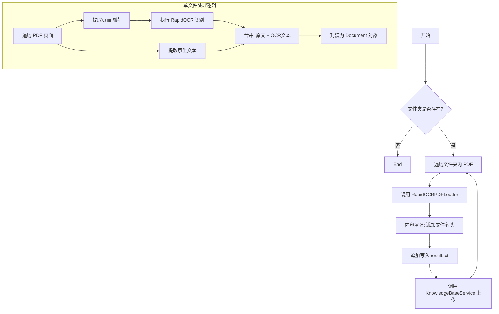

# 1. 处理知识库并将其上传到向量数据库中

这份文档详细说明了提供的 Python 脚本的逻辑。该脚本的主要功能是：**批量读取本地 PDF 文件，利用 OCR 技术提取文本（包括图片中的文字），对文本进行上下文增强，并最终将其上传至向量数据库（知识库）。**

---
## 1. 功能概述

该脚本旨在解决传统 PDF 加载器无法处理**扫描件**或**纯图片 PDF** 的问题。它采用“混合提取模式”，同时抓取可编辑文本和图片中的文本，确保数据完整性。处理后的数据会被赋予文件名作为上下文，并推送到后续的 `KnowledgeBaseService` 进行向量化存储。

## 2. 核心依赖

- **RapidOCR (`rapidocr_onnxruntime`)**: 用于对 PDF 中的图片进行文字识别。
    
- **PyMuPDF (`fitz`)**: 高性能 PDF 处理库，用于提取页面文本和图片二进制数据。
    
- **LangChain (`Document`)**: 标准化文档对象封装。
    

---

## 3. 逻辑流程详解

整个脚本的执行流程可以分为两个主要部分：**单文件加载逻辑** (`RapidOCRPDFLoader`) 和 **批量处理与入库逻辑** (`load_and_enhance_documents`)。

### 3.1 核心组件：`RapidOCRPDFLoader` 类

这是一个自定义的文档加载器，其核心逻辑在于“**查漏补缺**”。

- **步骤 1：初始化**
    
    - 实例化 `RapidOCR` 引擎，准备进行图像识别。
        
- **步骤 2：逐页扫描**
    
    - 使用 `fitz` 打开 PDF，遍历每一页。
        
- **步骤 3：双重提取（Hybrid Extraction）**
    
    - **文本提取**：首先尝试使用 `page.get_text()` 提取页面原本的文字（针对电子版 PDF）。
        
    - **图片提取与 OCR**：
        
        1. 扫描页面中的所有图片对象。
            
        2. 提取图片的二进制数据。
            
        3. 调用 `self.ocr` 进行文字识别。
            
        4. 将识别结果拼接成字符串。
            
- **步骤 4：内容合并**
    
    - 将“原有文本”和“OCR 识别文本”拼接在一起 (`text + "\n" + ocr_text`)。
        
    - _逻辑意义_：这样既能保证电子版 PDF 的准确性，又能覆盖 PDF 中嵌入的截图、表格图片或扫描页面的内容。
        
- **步骤 5：封装 Document**
    
    - 将合并后的文本封装为 LangChain 的 `Document` 对象。
        
    - 记录元数据 (`metadata`)，包含：文件路径、页码、文件名。
        

### 3.2 业务流程：`load_and_enhance_documents` 函数

这是脚本的主入口函数，负责文件管理、数据增强和持久化。

- **步骤 1：环境检查**
    
    - 检查配置的 `folder_path` 是否存在。
        
- **步骤 2：遍历文件**
    
    - 扫描文件夹下所有 `.pdf` 结尾的文件。
        
- **步骤 3：调用加载器**
    
    - 传入文件路径，获取 `RapidOCRPDFLoader` 返回的 `List[Document]`（即每一页是一个 Document）。
        
- **步骤 4：上下文增强 (Context Enhancement)**
    
    - 提取纯文件名（不含后缀）。
        
    - **关键操作**：在每页内容的开头强制加上 `【来源文件: filename】`。
        
    - _逻辑意义_：当这段文本被切片并存入向量库后，Retrieve（检索）阶段 AI 能够知道这段话出自哪本书或哪份合同，防止上下文缺失。
        
- **步骤 5：本地备份 (Logging)**
    
    - 将识别出的内容追加写入到本地的 `result.txt` 文件中，用于人工核查识别效果。
        
- **步骤 6：上传向量库**
    
    - 调用 `KnowledgeBaseService().upload_by_str(...)`。
        
    - 将处理好的文本字符串直接发送给后端服务进行 Embedding（向量化）和存储。
        

---

## 4. 数据流向图 (Workflow)

代码段




---

## 5. 代码中的关键细节说明

1. **异常处理**:
    
    - 脚本开头包含了对 `rapidocr_onnxruntime` 的导入检查，如果未安装会直接提示并退出，避免运行时错误。
        
    - 文件遍历循环中包含了 `try...except`，确保某一个 PDF 损坏不会导致整个批处理任务中断。
        
2. **OCR 策略**:
    
    - 代码采用了 `img_list = page.get_images(full=True)`。这意味着它不仅仅是对页面截图，而是提取页面内嵌入的每一个图片对象。这对于处理图文混排的 PDF 非常有效。
        
3. **结果返回**:
    
    - 注意代码中 `# documents.extend(docs)` 被注释掉了。
        
    - 这意味着 `load_and_enhance_documents` 函数实际上返回的是空列表 `[]`。
        
    - **结论**：该函数被设计为“副作用函数”（Side Effect），即它的主要目的不是返回数据，而是执行操作（写入文件、上传数据库）。
        
4. **文件写入模式**:
    
    - 使用 `with open("result.txt", "a", ...)` 追加模式。这保证了在循环处理大量文件时，前面的识别结果不会被覆盖。
        

## 6. 总结

这段代码是一个健壮的 **ETL（Extract, Transform, Load）脚本**：

- **Extract (提取)**: 使用 PyMuPDF 和 RapidOCR 从 PDF 中提取多模态文字信息。
    
- **Transform (转换)**: 增加文件名作为语义上下文，清洗格式。
    
- **Load (加载)**: 将清洗后的数据加载到向量知识库服务中。


# 2. 向量知识库服务模块

这份文档详细说明了 `knowledge_base.py` 模块的逻辑。该模块主要实现了一个**基于 ChromaDB 和 Ollama 的本地向量知识库服务**，具备内容去重、文本切分和向量持久化存储的功能。

---

## 1. 模块概述

该模块封装了 `KnowledgeBaseService` 类，用于管理本地知识库的核心操作。其主要职责是将纯文本数据（String）经过清洗、去重、切分后，通过 Embedding 模型转化为向量，并存储在 Chroma 向量数据库中。

## 2. 核心功能特性

- **内容去重 (MD5 Deduplication)**: 通过计算文本内容的 MD5 哈希值，防止相同的内容重复存入数据库。
    
- **智能切分 (Smart Splitting)**: 使用递归字符切分器 (`RecursiveCharacterTextSplitter`) 将长文本切分为适合模型处理的片段。
    
- **向量化存储 (Vector Storage)**: 集成 `Chroma` 数据库和 `OllamaEmbeddings`，实现文本到向量的转换与持久化。
    
- **元数据管理 (Metadata)**: 为存储的每一段文本自动附加来源、创建时间和操作人信息。
    

---

## 3. 详细逻辑流程

### 3.1 辅助函数：MD5 去重机制

为了避免重复处理相同的文本，模块利用本地文件 (`config.md5_path`) 记录已处理内容的指纹。

1. **`get_string_md5(input_str)`**:
    
    - 接收输入字符串，编码为 utf-8 字节流。
        
    - 利用 `hashlib.md5` 计算出 32 位十六进制的 MD5 字符串。
        
2. **`check_md5(md5_str)`**:
    
    - 检查记录文件是否存在。如果不存则创建并返回 `False`（未处理）。
        
    - 如果存在，逐行读取文件内容，比对传入的 MD5 值。
        
    - **逻辑**: 如果在文件中找到了该 MD5，说明该内容之前已经入库过，返回 `True`；否则返回 `False`。
        
3. **`save_md5(md5_str)`**:
    
    - 将新的 MD5 值追加写入到记录文件的末尾，作为已处理的标记。
        

### 3.2 核心类：`KnowledgeBaseService`

#### 初始化 (`__init__`)

在实例化服务时，执行以下配置：

1. **目录检查**: 确保向量库的持久化存储目录 (`config.persist_directory`) 存在。
    
2. **向量库实例 (`self.chroma`)**:
    
    - 初始化 Chroma 客户端。
        
    - 指定 Embedding 模型为 `OllamaEmbeddings` (模型名称来自 config)。
        
    - 设置持久化目录，确保数据重启不丢失。
        
3. **文本切分器 (`self.spliter`)**:
    
    - 初始化 `RecursiveCharacterTextSplitter`。
        
    - 配置 `chunk_size` (块大小) 和 `chunk_overlap` (重叠长度) 以保持语义连贯性。
        

#### 上传与入库 (`upload_by_str`)

这是该模块最核心的业务函数，接收文本数据和文件名。

**执行步骤：**

1. **计算指纹**: 调用 `get_string_md5` 计算当前文本的 MD5。
    
2. **去重校验**:
    
    - 调用 `check_md5`。
        
    - 如果返回 `True`，直接返回提示 `"[跳过]内容已经存在知识库中"`，**终止流程**。
        
3. **文本处理**:
    
    - 判断文本长度是否超过阈值 (`config.max_split_char_number`)。
        
    - **超过阈值**: 调用切分器 `self.spliter.split_text` 将长文本切分为多个片段 (`knowledge_chunks`)。
        
    - **未超阈值**: 将原文本直接作为唯一的片段。
        
4. **构建元数据**:
    
    - 为每个片段准备 Metadata 字典，包含：
        
        - `source`: 文件名。
            
        - `create_time`: 当前系统时间。
            
        - `operator`: 操作员（代码中固定为 "刘"）。
            
5. **向量化与存储**:
    
    - 调用 `self.chroma.add_texts`。
        
    - Chroma 内部会自动调用 Ollama 模型将 `knowledge_chunks` 转换为向量。
        
    - 将向量、文本内容和元数据一起存入本地数据库。
        
6. **记录指纹**:
    
    - 入库成功后，调用 `save_md5` 将当前文本的 MD5 写入记录文件。
        
7. **返回结果**: 返回成功提示信息。
    

---

## 4. 逻辑流程图 (Workflow)

代码段

```
graph TD
    Start[调用 upload_by_str] --> CalcMD5[计算文本 MD5]
    CalcMD5 --> CheckMD5{check_md5: 是否已存在?}
    
    CheckMD5 -- 是 (True) --> Skip[返回: 跳过，内容已存在]
    
    CheckMD5 -- 否 (False) --> CheckLen{文本长度 > max_split?}
    
    CheckLen -- 是 --> Split[使用 Spliter 切分文本]
    CheckLen -- 否 --> NoSplit[保持原文本]
    
    Split --> MakeMeta[构建 Metadata (时间/来源)]
    NoSplit --> MakeMeta
    
    MakeMeta --> Embed[调用 Chroma & Ollama 进行向量化]
    Embed --> SaveDB[存入向量数据库]
    
    SaveDB --> RecordMD5[调用 save_md5 记录指纹]
    RecordMD5 --> Success[返回: 成功载入]
```


---

## 5. 数据结构说明

### 5.1 存储在 Chroma 中的数据形态

对于每一条入库的知识，Chroma 会存储以下结构：

|**字段**|**说明**|**示例**|
|---|---|---|
|**Document**|切分后的实际文本内容|"周杰轮222"|
|**Embedding**|文本对应的向量数据|`[-0.012, 0.821, ...]` (由 Ollama 生成)|
|**Metadata**|辅助信息字典|`{'source': 'testfile', 'create_time': '2025-01-26...', 'operator': '刘'}`|
|**ID**|唯一标识符|UUID (自动生成)|

### 5.2 依赖配置 (`config_data`)

代码严重依赖 `config_data` 模块，预期该配置包含以下关键变量：

- `md5_path`: MD5 记录文件的路径。
    
- `persist_directory`: Chroma 数据库的存储路径。
    
- `collection_name`: 向量库集合名称。
    
- `EMBED_MODEL`: 使用的 Embedding 模型名称 (如 `nomic-embed-text` 或 `qwen`).
    
- `chunk_size` / `chunk_overlap`: 切分参数。
    
- `max_split_char_number`: 触发切分的长度阈值。

# 3. 向量检索服务模块文档

这份文档详细说明了 `VectorStoreService` 类的逻辑。该模块的主要作用是**封装 Chroma 向量数据库的读取操作**，并将静态的数据库对象转换为可用于 LangChain 流程（Chain）的动态检索器（Retriever）。

---

## 1. 模块概述

该模块封装了一个名为 `VectorStoreService` 的服务类。它的核心职责并非“写入”数据，而是**加载**已有的本地向量数据，并提供一个标准化的接口（Retriever）供上层应用进行语义搜索。

它是 RAG（检索增强生成）系统中的**检索（Retrieval）** 环节的核心组件。

## 2. 核心类：`VectorStoreService`

### 2.1 初始化逻辑 (`__init__`)

构造函数负责建立与本地 Chroma 数据库的连接。

- **输入参数**: `embedding` (嵌入模型实例)
    
    - 必须传入与构建知识库时**完全一致**的 Embedding 模型对象（例如 DashScope, Ollama 等）。如果不一致，会导致检索出的向量空间不匹配，无法搜到正确结果。
        
- **核心操作**:
    
    - 实例化 `langchain_chroma.Chroma` 对象。
        
    - **`persist_directory`**: 指定从哪里读取数据（必须与之前入库时的路径一致）。
        
    - **`collection_name`**: 指定读取哪一张“表”（集合）。
        

### 2.2 获取检索器 (`get_retriever`)

此方法将向量库对象转换为检索器对象，这是 LangChain LCEL 调用的关键步骤。

- **返回值**: `VectorStoreRetriever` 对象。
    
- **搜索参数配置 (`search_kwargs`)**:
    
    - 代码中使用 `{"k": config.similarity_threshold}` 来配置检索行为。
        
    - **关键逻辑说明**: 这里的参数 `k` 代表 **"Top K"**，即每次检索返回最相似的文档数量。
        
    - _注意：配置变量名为 `similarity_threshold`（通常暗示相似度阈值），但在代码中被赋值给了 `k`（返回数量）。这意味着该配置项实际上是在控制返回几条数据（例如 3 或 4 条）。_
        

---

## 3. 逻辑流程图 (Workflow)

代码段

```
graph TD
    subgraph Init [初始化阶段]
        Config[读取 config_data] --> Path(获取持久化路径 persist_directory)
        Embedding[传入 Embedding 模型] --> ChromaObj[初始化 Chroma 对象]
        Path --> ChromaObj
    end

    subgraph Runtime [运行时: get_retriever]
        ChromaObj --> AsRetriever[调用 .as_retriever()]
        ConfigK[读取 config.similarity_threshold] --> SetK{设置参数 k}
        SetK --> AsRetriever
        AsRetriever --> RetrieverObj[返回 Retriever 对象]
    end

    subgraph UserCall [调用示例]
        Query["用户提问: 体重180斤..."] --> RetrieverObj
        RetrieverObj --> VectorSearch[向量相似度搜索]
        VectorSearch --> Result[返回 Top K 个 Document]
    end
```

---

## 4. `if __name__ == '__main__':` 测试逻辑

代码底部的测试模块展示了该服务的实际调用方式：

1. **模型准备**: 引入 `DashScopeEmbeddings` 并使用 `text-embedding-v4` 模型（这是阿里云通义千问的嵌入模型）。
    
2. **服务实例化**:
    
    - `VectorStoreService(...)`: 传入嵌入模型，连接本地数据库。
        
    - `.get_retriever()`: 立即获取检索器接口。
        
3. **模拟检索**:
    
    - 调用 `retriever.invoke("我的体重180斤，尺码推荐")`。
        
    - 系统会将这句话转化为向量，在数据库中查找最相似的 `k` 条记录（比如衣服尺码对照表），并打印结果。
        

---

## 5. 依赖配置说明 (`config_data`)

该代码强依赖 `config_data` 模块中的以下变量，使用前需确保配置正确：

|**配置项**|**作用**|**逻辑影响**|
|---|---|---|
|`collection_name`|集合名称|类似于 SQL 中的表名，读写必须一致。|
|`persist_directory`|持久化目录|数据库文件在硬盘上的存储文件夹路径。|
|`similarity_threshold`|**返回数量 (Top K)**|决定检索器一次返回几条参考文档（注意代码中将其赋给了 `k`）。|

## 6. 总结

这段代码实现了 **"搜索接口"** 的功能。如果把之前的入库脚本比作“把书放进图书馆”，那么这段代码就是“图书管理员”。它不关心书是怎么来的，只负责根据用户的描述（Embedding），从指定的书架（Collection）上，拿出最相关的几本书（Top K Documents）。