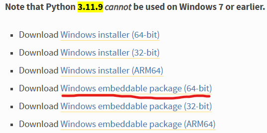

## 安装UV


## 在项目中初始化环境

### 1.UV初始化
```
uv init
uv python pin 3.11
```
### 2. 修改uv 项目的pyproject.toml文件
```toml
[project]
name = "rsai-gui"
version = "0.1.0"
description = "Add your description here"
readme = "README.md"
requires-python = ">=3.11, <3.12"
dependencies = [
    "einops>=0.8.1",
    "gdal",
    "nuitka>=2.8.9",
    "opencv-python>=4.13.0.90",
    "pyqt5==5.15.11",
    "pyqt5-qt5==5.15.2",
    "pyqt5-sip==12.17.2",
    "rasterio>=1.4.4",
    "scikit-image>=0.26.0",
    "scipy>=1.17.0",
    "timm>=1.0.24",
    "torch>=2.9.1",
    "torchvision>=0.24.1",
    "tqdm>=4.67.1",
]

[[tool.uv.index]]
name = "pytorch"
url = "https://download.pytorch.org/whl/cu130" #根据对应的cuda版本选择后缀
explicit = true

[tool.uv.sources]
torch = { index = "pytorch" }
torchvision = { index = "pytorch" }
gdal = { path = "C:/Users/ljx/Downloads/gdal-3.11.4-cp311-cp311-win_amd64.whl" }
# 手动下载的gdal包路径
```

同步配置文件

`uv sync`


---

## 第二章：制作绿色便携版 (Portable Build)

**目标**：构建一个独立的 `dist` 文件夹，包含 Python 解释器、所有依赖库（PyTorch/GDAL等）和源代码。该文件夹可直接拷贝到任何 Windows 电脑（即便是纯净系统）运行，无需配置环境。

### 2.1 准备嵌入式 Python 引擎

我们需要一个精简版的 Python 解释器作为程序的“心脏”。

1. 下载：
    
    前往 Python 官网下载 Windows embeddable package (64-bit)。
    
    - **版本要求**：必须与开发环境一致（建议 3.11.9）。
        
    - **下载地址**：[https://www.python.org/downloads/release/python-3119/](https://www.python.org/downloads/windows/)
         搜索python3.11.9下载系统对应架构的版本
         
1. **解压与重命名**：
    
    - 在项目根目录下新建文件夹 `dist`。
        
    - 将下载的压缩包解压到 `dist` 中。
        
    - 将解压出的文件夹重命名为 `python`。
        
    
    > 当前目录结构：
    > 
    > RSAI_GUI/dist/python/python.exe ...
    

### 2.2 解锁环境限制 (关键)

默认的嵌入版 Python 锁定了第三方库导入功能，必须手动开启。

1. 打开 `dist/python` 文件夹。
    
2. 找到 **`python311._pth`** 文件，使用记事本打开。
    
3. **修改**：取消最后一行 `import site` 前面的注释（去掉 `#` 号）。
    
    Plaintext
    
    ```
    python311.zip
    .
    
    # Uncomment to run site.main() automatically
    import site  <-- 确保这一行生效
    ```
    

### 2.3 向绿色版注入依赖库

我们将使用 `uv` 将开发环境中的依赖“灌入”这个独立的 Python 文件夹中。由于 GDAL 和 PyTorch 的特殊性，必须分步安装。

#### A. 导出基础依赖列表

在项目根目录运行：

PowerShell

```
# 仅导出依赖名，不包含具体环境路径
uv pip compile pyproject.toml -o requirements.txt
```

#### B. 手动安装特殊库 (GDAL & PyTorch)

由于嵌入版 Python 不读取 `pyproject.toml` 配置，我们需要手动指定本地 Wheel 和镜像源。

**在终端执行以下命令（注意路径）：**

1. **安装 GDAL (本地文件)**：
    
    PowerShell
    
    ```
    # 替换为你存放 whl 文件的实际路径
    uv pip install "D:\Downloads\GDAL-3.8.4-cp311-cp311-win_amd64.whl" --python dist/python/python.exe
    ```
    
2. **安装 PyTorch (指定 CUDA 源)**：
    
    PowerShell
    
    ```
    uv pip install torch torchvision --python dist/python/python.exe --extra-index-url https://download.pytorch.org/whl/cu124
    ```
    

#### C. 批量安装剩余依赖

让 uv 自动补齐 requirements.txt 中的其他库（如 PyQt6, NumPy 等）。

注意：必须再次指定 PyTorch 源，防止 uv 试图卸载 GPU 版换回 CPU 版。

PowerShell

```
uv pip install -r requirements.txt --python dist/python/python.exe --extra-index-url https://download.pytorch.org/whl/cu124
```

### 2.4 代码迁移与路径修正

#### A. 复制代码

将项目根目录下的所有源代码（`.py`）和资源文件夹（如 `assets`, `config`）复制到 `dist` 根目录下。

#### B. 修正模块导入路径 (sys.path)

由于嵌入版 Python 不会自动将当前脚本所在目录加入搜索路径，导致无法导入同级模块（如 `import testabc` 报错）。

**必须**在主入口文件（例如 `test_gui.py`）的**第一行**加入以下代码：

Python

```
import sys
import os

# --- 绿色版路径补丁 START ---
# 获取当前脚本所在的绝对目录，并强制加入搜索路径
current_dir = os.path.dirname(os.path.abspath(__file__))
sys.path.append(current_dir)
# --- 绿色版路径补丁 END ---

# 补丁生效后，再导入自定义模块
from testabc import test_gui 
import torch
# ...
```

### 2.5 编写通用启动脚本

为了实现“点击即用”，并在不同电脑上自动识别路径，我们需要编写一个批处理脚本。

在 `dist` 目录下新建 **`启动程序.bat`**：

代码段

```
@echo off
setlocal

REM 1. 获取当前 dist 文件夹的绝对路径
set "APP_ROOT=%~dp0"

REM 2. 指定嵌入式 Python 的路径
set "PYTHON_EXE=%APP_ROOT%python\pythonw.exe"

REM 3. 检查环境完整性
if not exist "%PYTHON_EXE%" (
    echo [错误] 找不到 Python 环境，请确认文件完整。
    pause
    exit /b
)

REM 4. 启动程序
REM 使用 pythonw.exe 运行以隐藏黑色控制台窗口
REM "%APP_ROOT%test_gui.py" 是你的主入口文件
start "" "%PYTHON_EXE%" "%APP_ROOT%test_gui.py"

endlocal
```

### 2.6 最终交付物检查

打包前的 `dist` 文件夹结构应如下所示：

Plaintext

```
dist/
├── python/               [文件夹] 包含 python.exe, Lib, site-packages
├── testabc/              [文件夹] 你的自定义包 (如果有)
├── test_gui.py           [文件] 主入口 (已加 sys.path 补丁)
├── test.py               [文件] 依赖代码
├── vc_redist.x64.exe     [文件] (可选但推荐) 微软常用运行库安装包
└── 启动程序.bat          [文件] 双击运行的入口
```

> **特别提示**：为了防止目标电脑（纯净 Win10/11）缺失 C++ 运行库导致 PyTorch/GDAL 报错，强烈建议下载 `VC_redist.x64.exe` 并放入 `dist` 目录，备注“如果运行报错请先安装此文件”。

---

文档说明：

至此，你的程序已经完成了从开发到便携发布的闭环。这个 dist 文件夹现在是一个完全独立的软件，不依赖系统环境变量，也不依赖目标电脑是否安装了 Python。

# 问题和解决办法

## 加载torch的DLL库失败

修改test_gui的导入顺序先导入torch再导入pyqt