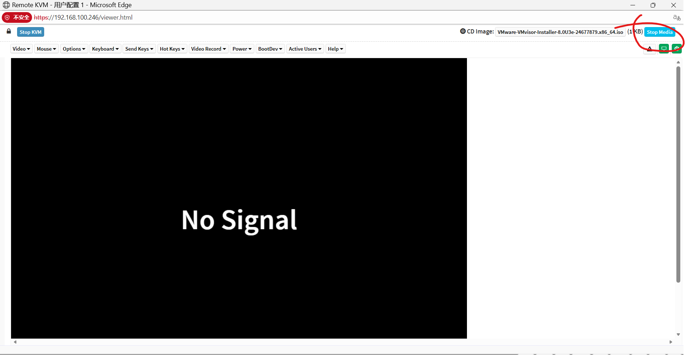
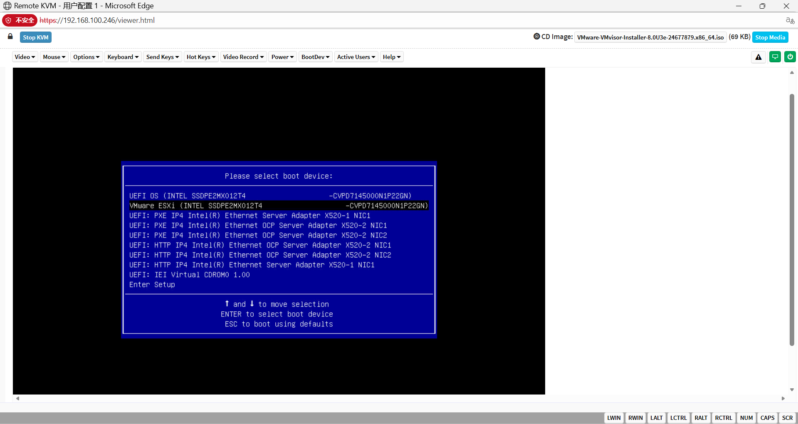

## 1.使用迅雷下载ESXI安装镜像

`https://pubdl.hausmer.com/esxi/VMware-VMvisor-Installer-8.0U3e-24677879.x86_64.iso`

镜像存放在nas的`/gongxiang/AI项目组/刘佳璇`
## 2.给服务器安装esxi系统

1. BMC挂载镜像
	 
2.  开启系统按F11进入启动项
	 
	 
	 选择 IEI Virtual CDROMO 1.00
	 