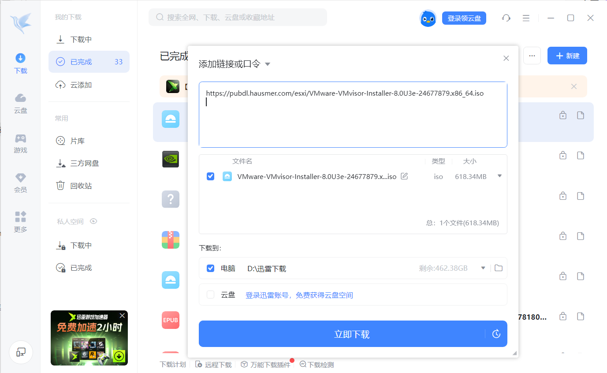

## 1.使用迅雷下载ESXI安装镜像

`https://pubdl.hausmer.com/esxi/VMware-VMvisor-Installer-8.0U3e-24677879.x86_64.iso`

镜像存放在nas的`/gongxiang/AI项目组/刘佳璇`
## 2.给服务器安装esxi系统

##### 密码 HBYB@123

耐心等待

安装完后拔掉U盘，按enter进行重启

  

  

# 3.配置静态ip

按F2 输入密码进入配置页面

选择 Configure Management Network

选择IPv4 Configuration

空格选择使用静态ip

填写要配置的ip 子网掩码 默认网关

选择Test Managemanage Network

  

#0 ping网关 # 1ping 自己 #2 ping 222.222.222.222

  

测试成功说明正常