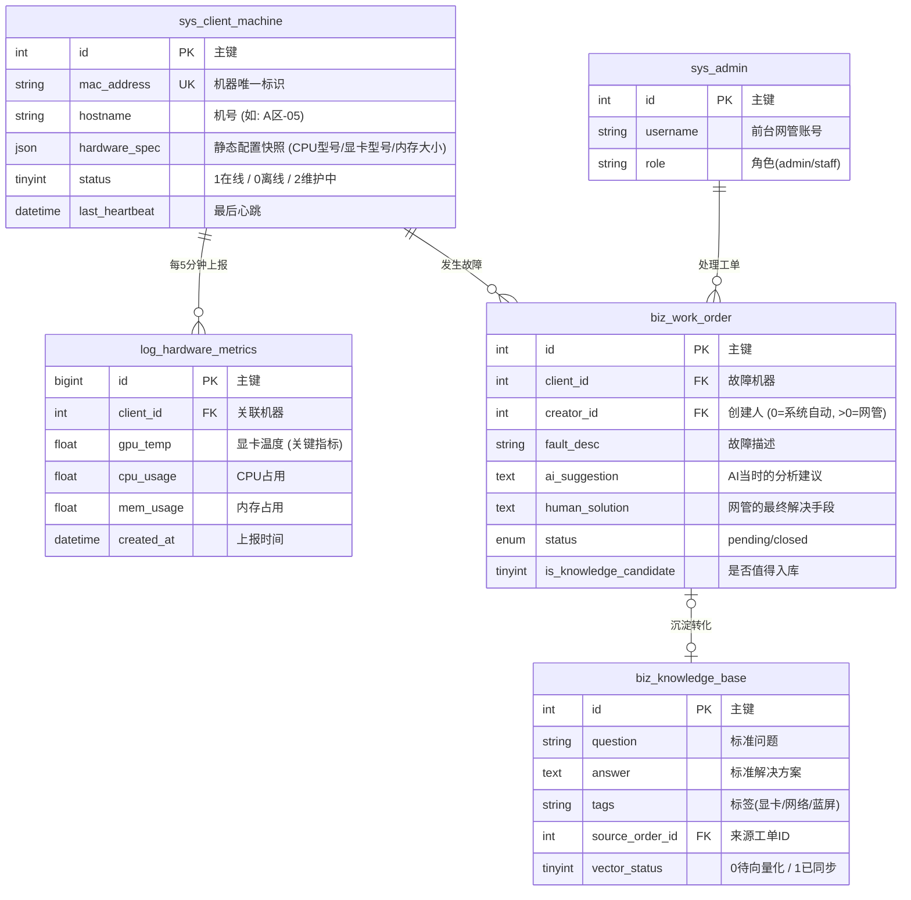

```mermaid

erDiagram
    %% ==========================================
    %% 1. 基础设施层 (Infrastructure)
    %% ==========================================
    sys_admin {
        int id PK "主键"
        string username "前台网管账号"
        string role "角色(admin/staff)"
    }

    sys_client_machine {
        int id PK "主键"
        string mac_address UK "机器唯一标识"
        string hostname "机号 (如: A区-05)"
        json hardware_spec "静态配置快照 (CPU型号/显卡型号/内存大小)"
        tinyint status "1在线 / 0离线 / 2维护中"
        datetime last_heartbeat "最后心跳"
    }

    log_hardware_metrics {
        bigint id PK "主键"
        int client_id FK "关联机器"
        float gpu_temp "显卡温度 (关键指标)"
        float cpu_usage "CPU占用"
        float mem_usage "内存占用"
        datetime created_at "上报时间"
    }

    %% ==========================================
    %% 2. 业务协同层 (Business Logic)
    %% ==========================================
    biz_work_order {
        int id PK "主键"
        int client_id FK "故障机器"
        int creator_id FK "创建人 (0=系统自动, >0=网管)"
        string fault_desc "故障描述"
        text ai_suggestion "AI当时的分析建议"
        text human_solution "网管的最终解决手段"
        enum status "pending/closed"
        tinyint is_knowledge_candidate "是否值得入库"
    }

    biz_knowledge_base {
        int id PK "主键"
        string question "标准问题"
        text answer "标准解决方案"
        string tags "标签(显卡/网络/蓝屏)"
        int source_order_id FK "来源工单ID"
        tinyint vector_status "0待向量化 / 1已同步"
    }

    %% ==========================================
    %% 关系 (Relationships)
    %% ==========================================
    
    %% 监控端行为
    sys_client_machine ||--o{ log_hardware_metrics : "每5分钟上报"
    
    %% 故障处理流程
    sys_client_machine ||--o{ biz_work_order : "发生故障"
    sys_admin ||--o{ biz_work_order : "处理工单"
    
    %% 知识沉淀流程
    biz_work_order |o--o| biz_knowledge_base : "沉淀转化"

```

